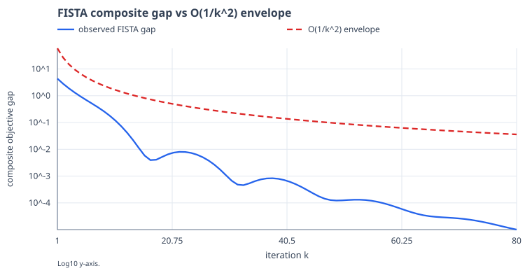

# ChainBench

[](https://github.com/chocoemong17/chainbench/actions/workflows/tests.yml)


**Understand a selected optimization result, change one condition, and replay the evidence.**

ChainBench is a small local learning and numerical-reproduction toolkit. It connects
published methods to assumptions, actual recurrences, reference formulas and plots
on synthetic problems with independently known solutions. It is not a production
solver, a theorem prover, or a reproduction of every experiment in the cited papers.

## 1. Start with a question, not a table

**One guided folder from the development source:**

```bash
python -m chainbench tour --lang ko --output tour
```

Open `tour/index.html`. Follow a published setup, inspect 2D/3D update geometry,
read the method atlas, then open all 32 seeded cases for each of the eight topics.
The whole folder works offline after generation; recipients only need a browser.
Every page retains its evidence and links back to the guide. See the
[tour contents, settings and file verification](docs/OFFLINE_TOUR.md).
Choose a new destination directory; existing folders are never overwritten.

| Feasible simplex updates | Composite objective heights |
| --- | --- |
|  |  |

These are controlled illustrations from the tour: simplex target (0.2,0.3,0.5),
start e1, C_f=2; diagonal LASSO a=(1,3), b=(1.4,-2.4), lambda=0.8,
start (-1.8,1.2), L=9. Both use 18 updates. The 3D chords connect actual samples;
they are not continuous paths on the surface. Open the reports for all cases and
exact settings. These commands are not included in the frozen v0.5.0 wheel.

**New in the development source (after v0.5.0):** independently recompute the
published setup behind Shewchuk's Figures 8 and 30, with linked contours, 3D heights,
actual iterate inspection and all nine additional starting points:

```bash
python -m chainbench reproduce shewchuk-1994 --lang ko --output paper.html
```

This is a specific published numerical example, with explicit differences from the
source figures; the nine variations are labelled separately. See the
[source/setup/validation contract](docs/SHEWCHUK_REPRODUCTION.md).
The command requires a source install; it is not in the frozen v0.5.0 wheel below.

For constrained motion, inspect Frank–Wolfe's chosen vertex and feasible update
segment on a triangle, alongside the same points on a 3D objective surface:

```bash
python -m chainbench geometry frank-wolfe --lang ko --output simplex.html
```

All 12 declared target/start combinations are inspectable. The objective gap, dual
certificate and theorem curve have distinct meanings, and one example explains why
a scheduled step can increase the objective. See the [source and geometry contract](docs/SIMPLEX_GEOMETRY.md).
This command also requires the development source after v0.5.0.

For the nonsmooth step in ISTA/FISTA, follow the actual extrapolated point, gradient
step and soft-thresholded iterate across nine regularization/start combinations:

```bash
python -m chainbench geometry ista-fista --lang ko --output proximal.html
```

The [proximal geometry guide](docs/PROXIMAL_GEOMETRY.md) explains exact zero
coordinates, composite contours/3D heights, theorem bounds and scaling conventions.
This is also a development-source feature, labelled as controlled illustrations.

For the full eight-topic learning atlas:

```bash
python -m chainbench learn --lang ko --output learn.html
```

Open `learn.html` in a browser. Eight topic cards explain **question → mechanism →
assumptions → recurrence → guarantee → observed curve → limitation**. Switch between
Korean and English, search a topic, expand bound-ratio plots, and save exact samples.
The page is self-contained. Browser controls do not run a new optimizer or upload data.

Development source also adds symbolic update flows, a two-method comparison of
operations and memory, and links between related ideas. These diagrams explain
the algorithms; the adjoining audited curves supply numerical observations.
See [the learning guide](docs/LEARNING_WORKFLOWS.md) for focused exports and scope.
Each canonical plot also identifies its actual problem, start and budget, with
expandable input arrays and method settings. A standalone SVG keeps both a visible
setup caption and exact input metadata; see [the data contract](docs/CANONICAL_CONTEXT.md).

Prefer a compact fixed-suite dashboard or one figure?

```bash
python -m chainbench report --output report.html
python -m chainbench plot beck-teboulle-2009 --output fista.svg
```



This example is generated from the plotting implementation, not a fabricated result
or an external review. Source mapping and the scope of each result are explicit in
[docs/SOURCE_MAP.md](docs/SOURCE_MAP.md).

## Evidence before aesthetics: one plot is not enough

Every paper page now labels the evidence level explicitly:

1. **Literature claim** - assumptions and the selected public result.
2. **Canonical illustration** - one transparent problem chosen for intuition, not representativeness.
3. **Seeded stress** - many reproducible sampled instances of the same measurement.
4. **Published tight case** - only when public literature supplies an extremal construction.

```bash
python -m chainbench stress nesterov-1983 --trials 24 --seed 0 --lang ko --output stress.html
```

**Development source after v0.5.0:** stress reports now retain all actual inputs and
trajectories, vary dimensions and starts, and link ranked/individual samples to their
curves. `chainbench stress-case nesterov-1983 --seed 10 --output case.html` reruns one
sample. Undefined ratios remain visible; they are never reported as zero successes.
This uses sampler/schema **v2**, so old seed numbers alone do not identify the same
inputs. See [sampling, metrics and migration](docs/STRESS_SAMPLING.md).

For geometric intuition, compare the **same run** as a contour path, a 3D objective surface and a loss curve:

```bash
python -m chainbench landscape --condition-number 20 --methods gd smooth-fista heavy-ball cg proximal-point --lang ko --output landscape.html
```

The 2D landscape is deliberately chosen for clarity and is labelled as an illustration. It is not used as evidence of universal superiority. See [evidence layers](docs/EVIDENCE_LAYERS.md).

## Install v0.5.0

Use Python 3.10+ in a new virtual environment. NumPy is the only runtime dependency;
no API key, telemetry or paid service is required. Pip may need network access during
installation; calculations and HTML viewing are local afterward.

```bash
python -m venv .venv
# Linux/macOS: source .venv/bin/activate
# Windows: use .venv\Scripts\python.exe in place of python below
python -m pip install https://github.com/chocoemong17/chainbench/releases/download/v0.5.0/chainbench-0.5.0-py3-none-any.whl
python -m chainbench --version
python -m chainbench learn --lang ko --output learn.html
```

Alternatively install the local wheel from [GitHub Releases](https://github.com/chocoemong17/chainbench/releases).
Do not assume a same-named registry package is this project; no PyPI publication is
configured. From a source checkout, run `python -m pip install .` in its root.

## 2. Change one condition

```bash
python -m chainbench sweep --preset quadratic --parameter condition_number --values 10 100 1000 --methods gd smooth-fista cg --lang ko --output conditioning.html
```

Compare actual trajectories at 2–8 values, with every resolved config and observation
preserved. All inputs and the **combined** work budget are validated first. Different
panels may have different y-axis ranges and objective scales; this is not a speed
leaderboard or universal method ranking.

Single runs still accept direct settings or reusable JSON:

```bash
python -m chainbench experiment --preset quadratic --dimension 20 --condition-number 100 --steps 50 --methods gd cg --format html --output custom.html
python -m chainbench preset quadratic --random-seed 17 --output config.json
python -m chainbench experiment --config config.json --output saved.json
```

The seed samples existing synthetic configuration knobs, not arbitrary data or
certified worst cases. See [configuration reference](docs/EXPERIMENTS.md).

## 3. Replay, rather than trusting a saved number

```bash
python -m chainbench replay saved.json --lang ko --output replay.html
```

This **recomputes** a complete schema-1 saved experiment and compares trajectories,
parameters, inputs and environments. `MATCH` means observed agreement within the
specified tolerances and identical input-byte fingerprints. `INPUT_DIFFERENCE` and
`MISMATCH` remain visible. A match is not authentication of the author or proof that
an independent person ran the original. Missing/non-finite evidence is an error.

## 4. Inspect one public tight example

```bash
python -m chainbench case-study gd-tight --horizon 20 --lang ko --output tight.html
```

The separate Drori–Teboulle case constructs a one-dimensional Huber objective that
attains a specific published bound for constant-step GD with `0<h<=1`. Changing the
horizon changes the function. The mathematical worst-case assertion comes from the
public upper bound and matching construction, not a numerical search or a graph.
See [exact source, formula and limits](docs/GD_TIGHT_CASE.md).

## Read each paper as a research story

The learning page is no longer just "formula + one graph". For every bundled topic it now adds **why the work mattered, strengths, trade-offs, the neighboring method to compare against, and the evidence type**. A small timeline connects CG, heavy-ball, proximal point, Nesterov acceleration, FISTA and Frank-Wolfe instead of presenting them as unrelated cards.

The canonical figure is explicitly labelled as ChainBench-generated. It is not implied to be a figure from the original paper. The source link remains next to the selected theorem/specialization.

## Scope and evidence

The original suite is unchanged: GD, Nesterov-style smooth FISTA, quadratic heavy-ball,
CG, Frank–Wolfe, exact quadratic proximal point, FISTA and an INFO-only ISTA comparison.
There are seven quantitative conditions plus one informational comparison. Historical
Nesterov naming, empirical heavy-ball tolerance and the small synthetic fixtures are
explicitly distinguished from entire-paper reproduction.

Existing Python method APIs and JSON/CSV/Markdown exports remain available. `report`
defaults to HTML; `experiment` defaults to JSON. New workflow pages have optional local
JavaScript controls; the old fixed reports remain script-free. Existing files require
`--force` to overwrite; input files cannot be replaced by their own outputs.

[Learning/sweep/replay guide](docs/LEARNING_WORKFLOWS.md) ·
[Public references](REFERENCES.md) · [Roadmap](ROADMAP.md) ·
[Contributing](CONTRIBUTING.md) · [Release process](RELEASING.md)

## Validation and feedback

```bash
python -m pip install -e '.[dev]'
ruff check .
python -m pytest
python scripts/check_mutations.py
python -m build
python scripts/smoke_install.py
```

CI covers Ubuntu Python 3.10–3.12, Windows/macOS Python 3.12 and a minimum-dependency
environment. Wheel and sdist are installed in separate clean environments outside the
checkout; old and new CLI outputs are exercised before release. Tests are evidence
about implemented cases, not an exhaustive correctness proof or independent adoption.

[Report actual success, failure or confusion in issue #28](https://github.com/chocoemong17/chainbench/issues/28).
The seven-person feedback there is maintainer-relayed and motivated the evidence-layer, stress-sampling and geometry redesign. No star or favorable review is
requested. The [v0.2.0 review helper](review/README.md) remains a frozen historical
baseline, not the latest package. Prior releases are preserved.

Only public literature and independent code belong here. No private research,
unpublished derivations, private datasets or real-name maintainer metadata are needed.
MIT license. Public maintainer: **chocoemong17**.
