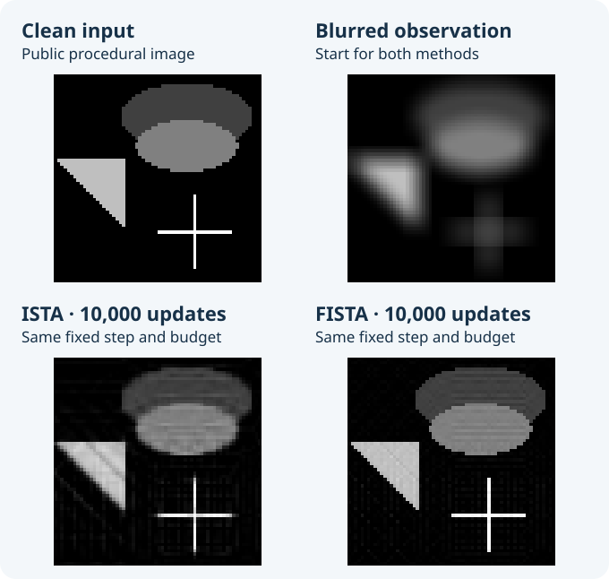
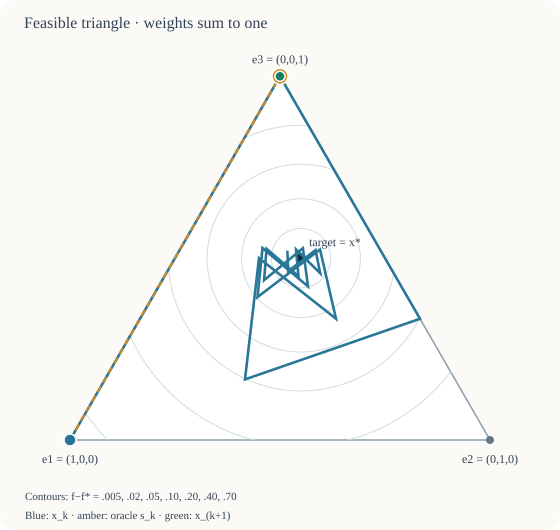
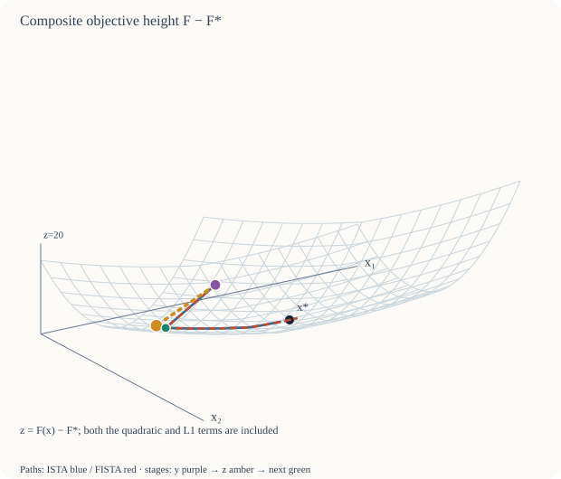

# ChainBench

[](https://github.com/chocoemong17/chainbench/actions/workflows/tests.yml)


**Landmark machine-learning papers, explained through motion and interactive examples.**

For curious beginners and educators: six short visual lessons in English and Korean,
with source-linked calculations for deeper study.
[Project & classroom use — a two-minute route](https://chocoemong17.github.io/chainbench/about/) ·
[한국어 소개](https://chocoemong17.github.io/chainbench/about/?lang=ko)

### Start in your browser

[**Explore six visual paper lessons →**](https://chocoemong17.github.io/chainbench/papers/)
([deployment status](https://github.com/chocoemong17/chainbench/actions/workflows/pages.yml)).
Six landmark papers, each with a film under one minute, two interactive diagrams and
a direct link to the original paper. Start with the motion, drag the calculation,
then explore the source. No ZIP, Python installation or sign-in is needed.

- [Adam](https://chocoemong17.github.io/chainbench/papers/adam/): coordinate-wise steps in a steep valley.
- [Attention](https://chocoemong17.github.io/chainbench/papers/attention/): query–key matching and a weighted mix.
- [ResNet](https://chocoemong17.github.io/chainbench/papers/resnet/): an identity shortcut and an added correction.
- [Backpropagation](https://chocoemong17.github.io/chainbench/papers/backprop/): branched gradients and six updates toward a target.
- [CNN](https://chocoemong17.github.io/chainbench/papers/cnn/): moving numbered filters, channel stacks and weight sharing.
- [Dropout](https://chocoemong17.github.io/chainbench/papers/dropout/): changing participation across two hidden layers.

The films use explicit constructed examples, with computed records and stated
scope; they do not reproduce full model-training experiments.
[Adam, Attention and ResNet sources](docs/VISUAL_PAPERS.md) ·
[Backpropagation, CNN and Dropout sources](docs/FOUNDATIONS.md). The [broader explorer and 25 reports](https://chocoemong17.github.io/chainbench/) remain available.

Teaching a class? Use the [short preparation and activity guide](docs/TEACHING_GUIDE.md)
([한국어](docs/TEACHING_GUIDE.ko.md)). [Field notes from five middle-school sessions](docs/CLASSROOM_PILOT.md)
report 150 post-session responses: 139 reported understanding most or almost all,
73 reported positive interest, and 54 wanted another topic. These are self-reports
about earlier material, not measured learning gains or an evaluation of the three
new lessons. [Feedback and resulting changes](docs/IMPROVEMENTS.md).

English opens by default; choose **한국어** to switch. Continue directly into the
25-page reading tour, including image recovery and 2D/3D geometry. The first
explorer computes new browser trajectories; paper-report controls inspect their
recorded results. [What is computed, tested and published](docs/WEBSITE.md).
Each website update is published only after its complete main-branch checks pass.
The versioned offline downloads below remain available.

ChainBench connects published optimization methods to their assumptions, update
rules and actual calculations. Explore 2D contours, 3D objective surfaces, image
reconstructions and reproducible instance families in local, bilingual reports.
Python 3.10+ and NumPy generate the pages; a browser is enough to read or share them.

**Prefer an offline copy? [Download the offline tour and PDF](docs/OFFLINE_DOWNLOAD.md)**, then
follow the [short reading route](docs/REVIEW_GUIDE.md#a-short-reading-route).
The published v0.7.0 alpha includes the offline reading tour and Python package;
the live website also includes subsequent visual-lesson improvements.
The preceding v0.6.0 downloads remain available.
For a quick preview without installation or sign-in, open the
[two-page FISTA PDF](https://github.com/chocoemong17/chainbench/blob/archive/local-reviews-20261001/cloud/33b6243/ChainBench_FISTA_review.pdf)
or [five actual geometry views with Korean reading notes](https://github.com/chocoemong17/chainbench/tree/archive/local-reviews-20261001/cloud/33b6243/browser-gallery).
These archived previews include their source and verification records.

Already have several saved runs? [Compare two to four experiment records](docs/SAVED_COMPARISON.md)
with `chainbench compare a.json b.json --lang ko --output comparison.html`.
Inspect changed inputs, settings and environments before reading the actual curves.

To **change conditions and compute a new result**, use the
[experiment studio](docs/STUDIO.md): `chainbench studio --lang ko`.
Choose quadratic, diagonal LASSO or simplex inputs, select methods, and inspect
actual computed rows. Download input JSON, result JSON and a standalone report;
the report works after you stop the studio.

To **keep and rerun the actual numbers**, use
[stored numeric inputs and exact replay](docs/STORED_INPUTS.md):
`instance generate`, `instance import`, `instance run` and `instance replay`.
Save the arrays and starting point, then rerun those same inputs without drawing
new data. Imported teaching examples include a nondiagonal quadratic and a PSD
problem where distance to a supplied reference differs from distance to a solution.

These two workflows are new in the v0.7.0 source and require its Python package.
The reading ZIP contains precomputed paper reports; it does not start a studio
or contain your future experiments. [Release notes](docs/RELEASE_NOTES_0.7.0.md)
explain installation, evidence and limits. The frozen v0.6.0 and earlier releases
retain their original contents.

## From a paper's experiment to actual pixels



A rerun of the **ISTA/FISTA subset of Beck–Teboulle (2009), Section 5.2 / Figure 5**:
64×64 public procedural image, 9×9 Gaussian blur with sigma=4 and edge-repeating
symmetric boundaries, no noise, lambda=0, L=2 and step=1/2. Both methods start at
the blurred observation and take 10,000 updates. All images share the [0,1] grayscale;
only display pixels are clipped.

| Actual observation at 10,000 updates | ISTA | FISTA |
| --- | ---: | ---: |
| Squared residual to the blurred observation, F | 1.247403e-4 | 1.109953e-8 |
| Pixel RMSE against the clean input | 4.576756e-2 | 2.017030e-2 |

A small residual does not imply exact image recovery. This is one published
synthetic protocol, with explicit source-version and coordinate differences;
it does not assert exact reproduction of the paper's reported endpoints.
[Inspect the source, inputs, permission and differences](docs/FISTA_DEBLURRING.md).
The [preview generator](scripts/render_readme_image.py) uses the same saved numerical
record as the full report, including hashes and attribution.

## Download a reading bundle from GitHub

The published [v0.7.0 alpha release](https://github.com/chocoemong17/chainbench/releases/tag/v0.7.0)
provides a [reading ZIP](https://github.com/chocoemong17/chainbench/releases/download/v0.7.0/chainbench-0.7.0-reading.zip)
and [two-page PDF](https://github.com/chocoemong17/chainbench/releases/download/v0.7.0/chainbench-0.7.0-review.pdf).
The [v0.6.0 assets](https://github.com/chocoemong17/chainbench/releases/tag/v0.6.0)
remain available as an earlier snapshot. Extract the whole ZIP and open `index.html`: all 25
pages, their figures and recorded examples work offline. The named reading ZIP
contains generated reports; GitHub's automatic source archive contains source code.
[Download, availability and verification guide](docs/OFFLINE_DOWNLOAD.md).

For an unreleased candidate, a successful
[tests run](https://github.com/chocoemong17/chainbench/actions/workflows/tests.yml)
provides `chainbench-reading-release-<commit>`. Actions artifacts require sign-in
and expire after seven days; release assets are separate from that retention.
The reading assets are generated, independently audited, extracted and checked in
offline desktop/mobile Chromium on GitHub. [Workflow and evidence scope](docs/CLOUD_WORKFLOW.md).

## Run the tour

The **FISTA backtracking** inspector shows how a proposed step is
rejected or accepted. Explore all 12 objective/start inputs with three initial
curvature guesses, then follow the accepted 2D/3D path, every rejected proposal,
and the actual objective/model slice. Accepted L carries to the next update;
the page exposes later changes and objective increases. This additional report
is included in v0.6.0 and the current source checkout. The extended
tour connects it to fixed-L FISTA with symbolic update flows, an actual rejected
candidate preview and a comparison of thresholds, carried curvature and bounds. [Source, recurrence and numerical scope](docs/FISTA_BACKTRACKING.md).

```bash
python -m chainbench geometry fista-backtracking --lang ko --output backtracking.html
```

The **ADMM LASSO geometry** report explains variable splitting through
36 declared 2D inputs. Follow the quadratic solve, coordinate shrinkage and dual
memory on original-objective contours, a 3D gap surface and a subgradient box.
Within each recorded step, inspect the quadratic subproblem's own contours and
the two scalar shrinkage inputs after adding the previous memory. Their fixed
axes retain even the large shifted inputs; their metrics are named separately
from the original objective. The iteration control stays visible while scrolling.
See why an infeasible split value can lie below the original optimum, and why a
zero original gap need not pass both residual tests. All cases and initial
undefined values remain inspectable offline. A complete matrix/start/penalty
overview shows each final residual decision, both normalized residuals, first
pass and original-objective gap. Choose any cell to inspect its actual final
2D/3D state; the same link opens its native numerical row without scripts.
[Source, equations and scope](docs/ADMM_GEOMETRY.md). The extended tour connects
it to ISTA/FISTA with symbolic flows and a notation table: their y/z variables,
thresholds, input grids and per-iteration work differ. Open the report separately with:

```bash
python -m chainbench geometry admm-lasso --lang ko --output admm.html
```

The Adam report, also linked from the extended tour, follows **Reddi–Kale–Kumar's Theorem 1** one round
at a time: changing losses, second-moment memory, actual proposals and interval
projections. Compare all nine declared inputs for the paper's Adam and AMSGrad
variants, including a slowly progressing AMSGrad case. This uses the source's
no-debiasing analysis variant; it is not a claim about modern Adam defaults.
The three-round inspector places each stored proposal and projected move on a
shared position axis. Its signed ledger explains how changing denominator
memory affects the two return steps, and distinguishes complete-block regret
from an unfinished block. All nine cases retain a native first-block view.
[Source, regret definition and scope](docs/ADAM_COUNTEREXAMPLE.md).
Open the report with:

```bash
python -m chainbench reproduce reddi-2018 --lang ko --output adam.html
```

The randomized Kaczmarz case study adds Strohmer–Vershynin's
construction: rotate actual 3D coordinate projections, compare six inputs and
keep every seed while distinguishing exact expectation from a finite sample mean.
[Source and scope](docs/KACZMARZ_EXPECTATION.md). It can be opened separately or
in the extended tour:

```bash
python -m chainbench case-study kaczmarz-expectation --lang ko --output kaczmarz.html
```

To generate the smaller default tour from a source checkout:

```bash
python -m pip install .
python -m chainbench tour --lang ko --output tour
```

For the versioned wheel, follow the [installation steps](#install-v070).
Open `tour/index.html`. It connects **17 offline HTML pages**: the reading guide,
eight-topic atlas, three published-example workflows, three geometry views, eight
stress reports and one public tight case. Each report keeps its numerical evidence
and links back to the guide. The recipient needs no server, account or Python.

The latest local atlas also connects each topic directly to its included
experiments through question-led cards. Standalone pages provide reproducible
commands; tour cards open local files and reports link to their related lesson.
[How the reading paths work](docs/LEARNING_WORKFLOWS.md#follow-a-topic-into-its-actual-reports).

Use a new destination directory. The whole folder is about 45 MB uncompressed;
copy the folder to preserve its links. [Contents, settings and hashes](docs/OFFLINE_TOUR.md).

The complete **25-page** path connects noisy Haar restoration, the sharp
Frank–Wolfe sparsity construction, randomized Kaczmarz expectation attainment
and nonuniform signal recovery with CG spectral breadth, the Adam counterexample
ADMM variable splitting and FISTA candidate tests.
Its comparison of fixed-objective gaps and changing-loss regret keeps their scopes separate.
The index reports the actual file size. Generate the complete tour with:

```bash
python -m chainbench tour --extended --lang ko --output tour-extended
```

Open `tour-extended/index.html`. The release reading ZIP uses this complete
25-page path; the default 17-page tour remains available for a smaller download.

## Choose the question you want to answer

| Question | Open in the tour | What the evidence supports |
| --- | --- | --- |
| How do CG's geometry and polynomial bound relate to its actual error? | `shewchuk.html` | Exact published setup; x/A-metric paths and eigenmode errors; source comparison polynomials; nine labelled added starts |
| Does one iteration mean the same work for every method? | `landscape.html` | Five methods on one stated quadratic; actual settings, equal contour scales and labelled early stopping |
| Does fitting blurred data recover the clean image? | `deblur.html` | One declared image protocol; all 10,001 objective/RMSE observations per method |
| Why shrink actual image coefficients? | `wavelet.html` (extended) | Noisy 256×256 Figure 4 protocol with a declared noise draw; unknown optimum |
| Can quadratic tuning fail on a smooth strongly convex function? | `heavy-ball.html` | Lessard–Recht–Packard's published counterexample; eight separately labelled added starts |
| How does an oracle respect a constraint, and how far should its step go? | `simplex.html` | Twelve controlled Frank–Wolfe cases, actual surface curves and local segment minima |
| How does using few atoms limit accuracy? | `fw-sparsity.html` (extended) | Sharp support minimum, actual FW weights and a dual floor valid only before full support |
| Can a valid random run lie above an expected-error bound? | `kaczmarz.html` (extended) | Six published-family inputs, all 64 seeds, actual 3D projections and exact expectations versus finite means |
| How does selecting observations change signal recovery? | `sampling.html` (extended) | Published 700-sample / 101-coefficient protocol; all three declared inputs, three row-selection rules and 15,000 projections |
| Can the same condition number give different CG convergence? | `cg-spectrum.html` (extended) | All 18 declared spectra/bases/starts; actual signed mode ratios, energy weights and separate comparison polynomials |
| What changes when an optimizer forgets a large gradient? | `adam.html` (extended) | Nine declared inputs for the source's no-debiasing Adam/AMSGrad variants; actual memory, projection and online regret; complete-block lower references |
| How can the same shrinkage operator sit in different algorithms? | `admm.html` (extended) | 36 controlled inputs; actual x/z/y states, original versus split values, both residual tests; notation and subproblem bridge to ISTA/FISTA |
| What do momentum and soft thresholding do? | `proximal.html` | Nine controlled lambda/start cases with actual intermediate stages |
| Does a claim survive more sampled inputs? | `stress-<topic>.html` | All 32 seeds per topic, including unresolved ratios |
| Why can a bound be called tight? | `tight-gd.html` | A public upper bound and matching construction under stated assumptions |
| How are the ideas related? | `atlas.html` | Symbolic flows, assumptions, results, trade-offs and linked methods |

| A feasible Frank–Wolfe update | ISTA/FISTA at actual objective heights |
| --- | --- |
|  |  |

These previews are controlled illustrations: simplex target (0.2,0.3,0.5), start e1,
C_f=2; diagonal LASSO a=(1,3), b=(1.4,-2.4), lambda=0.8, start (-1.8,1.2), L=9.
Both use 18 updates. The 3D chords join actual samples; they are not continuous
paths on the surface. [Simplex contract](docs/SIMPLEX_GEOMETRY.md) ·
[Proximal contract](docs/PROXIMAL_GEOMETRY.md).

Every plot identifies its problem, start, parameters, budget, metric and source.
Canonical illustrations, finite stress, published-example reruns and tight
constructions answer different questions. [Read the evidence distinctions](docs/EVIDENCE_LAYERS.md).

## Generate only the page you need

```bash
python -m chainbench reproduce shewchuk-1994 --lang ko --output paper.html
python -m chainbench reproduce fista-deblurring --lang ko --output deblur.html
python -m chainbench reproduce fista-wavelet --lang ko --output wavelet.html
python -m chainbench reproduce lessard-2016 --lang ko --output cycle.html
python -m chainbench reproduce kaczmarz-sampling --lang ko --output sampling.html
python -m chainbench geometry frank-wolfe --lang ko --output simplex.html
python -m chainbench geometry ista-fista --lang ko --output proximal.html
python -m chainbench geometry admm-lasso --lang ko --output admm.html
python -m chainbench learn --lang ko --output learn.html
python -m chainbench stress nesterov-1983 --trials 32 --seed 0 --lang ko --output stress.html
python -m chainbench case-study gd-tight --horizon 20 --lang ko --output tight.html
python -m chainbench case-study fw-sparsity --lang ko --output sparsity.html
python -m chainbench case-study cg-spectrum --lang ko --output cg-spectrum.html
```

Reports support Korean and English, local controls, raw records and reading with
JavaScript disabled. Controls inspect stored computations; they do not run an
optimizer in the browser. Standalone SVGs retain setup captions and input metadata.
[Visual formats](docs/VISUAL_REPORTS.md) · [Learning workflows](docs/LEARNING_WORKFLOWS.md).

The standalone [CG spectral study](docs/CG_SPECTRUM.md) holds the dimension,
eigenvalue interval and condition number fixed while varying all three spectra,
two coordinate bases and three initial-error profiles. Inspect actual signed
mode ratios and energy bars alongside explicitly separate comparison polynomials.
All 18 inputs and every computed step remain available offline, separately or in
the extended tour, with links to the published 2×2 example.

The separate [nonuniform signal experiment](docs/NONUNIFORM_SAMPLING.md) follows
Strohmer–Vershynin's 700-sample / 101-coefficient protocol with three declared
new inputs. Inspect actual reconstructed waveforms, every row-selection
probability and all 15,000 projections of cyclic, uniform and weighted Kaczmarz.
The projection explanation connects a single chosen observation to the actual
before/after waveforms and global Fourier response, retaining rounding differences.
The first input deliberately remains visible when a sufficient gap condition
does not apply.

The separate [noisy Haar experiment](docs/FISTA_WAVELET.md) adds 256×256 restoration
with positive λ, actual wavelet shrinkage and a declared noise draw. Its default
200 updates follow Figure 4's protocol; the unknown optimum is never labelled
zero. Its full-array export
is about 30 MB; the optional extended tour includes it at seed 0 and 200 updates.

The subsequent [Frank–Wolfe sparsity construction](docs/FW_SPARSITY.md) connects
Jaggi's sharp support floor to actual atom weights across four dimensions and a
three-coordinate objective surface. It distinguishes support size from iteration,
and ends the dual lower bound at full support.

The [heavy-ball counterexample](docs/HEAVY_BALL_COUNTEREXAMPLE.md) connects the
actual function, signed iterates and `(previous, current)` state plane. Its published
three-cycle explains why a small repeat difference can coexist with a nonzero
gradient. The same method's successful quadratic fixture remains a separate story.

The newer [CG spectral explanation](docs/CG_SPECTRAL_EXPLANATION.md) connects
Shewchuk's exact comparison polynomials to the same saved errors in all ten starts.
Actual mode ratios and weighted norm error are distinguished from minimax bounds;
absent initial modes remain undefined.

## Change a condition and replay a calculation

```bash
python -m chainbench sweep --preset quadratic --parameter condition_number --values 10 100 1000 --methods gd smooth-fista cg --lang ko --output conditioning.html
python -m chainbench experiment --preset quadratic --dimension 20 --condition-number 100 --steps 50 --methods gd cg --output saved.json
python -m chainbench replay saved.json --lang ko --output replay.html
```

A sweep changes one declared factor. A replay recomputes a schema-1 experiment and
compares inputs, trajectories and environments with stated tolerances. A `MATCH`
is numerical agreement, not author authentication or proof. Equal iteration counts
need not mean equal work. [Configuration and limits](docs/EXPERIMENTS.md).

## Install v0.7.0

Use Python 3.10+ in your preferred environment to install the
[published alpha](https://github.com/chocoemong17/chainbench/releases/tag/v0.7.0):

```bash
python -m pip install https://github.com/chocoemong17/chainbench/releases/download/v0.7.0/chainbench-0.7.0-py3-none-any.whl
python -m chainbench --version
python -m chainbench tour --extended --lang ko --output tour
```

The reading ZIP needs no installation. To recompute reports, use the wheel above
or install a pinned source checkout. Record both the package version and commit
when comparing results. [Release notes and migration](docs/RELEASE_NOTES_0.7.0.md).

The [frozen v0.5.0 baseline](https://github.com/chocoemong17/chainbench/releases/tag/v0.5.0)
remains available with its original assets. Earlier development builds also reported
0.5.0; their commit distinguishes them from that release. No PyPI publication is
configured; do not assume a same-named registry package is this project.

## Scope and validation

The fixed suite covers GD, smooth fixed-L FISTA under a historical Nesterov slug,
quadratic heavy-ball, CG, Frank–Wolfe, exact quadratic proximal point, FISTA and an
INFO-only ISTA comparison. Heavy-ball's tolerance is empirical. A finite sample
cannot prove a theorem or a universal ranking. ChainBench is an experimental alpha,
not a production solver or a reproduction of every experiment in each paper.
[Exact source-to-implementation mapping](docs/SOURCE_MAP.md) · [Public references](REFERENCES.md).

```bash
python -m pip install -e '.[dev]'
ruff check .
python -m pytest
python scripts/check_mutations.py
python -m build
python scripts/smoke_install.py
```

CI checks Ubuntu Python 3.10–3.12, Windows/macOS Python 3.12, minimum dependencies,
both clean distribution installs, an audited reading ZIP/PDF, and offline Chromium
at desktop/mobile widths. The nine validation jobs include extraction and reading
of the exact ZIP prepared for release. Numerical records are checked against rendered curves, points and image pixels.
These are maintainer-controlled checks, not independent adoption evidence.

[Report a concrete success, failure or confusing explanation](https://github.com/chocoemong17/chainbench/issues/28).
The seven-person feedback there is maintainer-relayed. The [v0.2.0 reviewer kit](review/README.md)
is a frozen historical baseline. No stars or favorable reviews are requested.

[Roadmap](ROADMAP.md) · [Contributing](CONTRIBUTING.md) · [Release process](RELEASING.md)

NumPy is the only runtime dependency. No API key, telemetry or paid service is
required. Installation may use the network; calculations and generated reports are
local afterward. Only public literature and licensed inputs belong here.
MIT license for ChainBench; the image-generator port retains its
[ReguTools permission notice](docs/licenses/REGUTOOLS.txt).
Public maintainer: **chocoemong17**.
