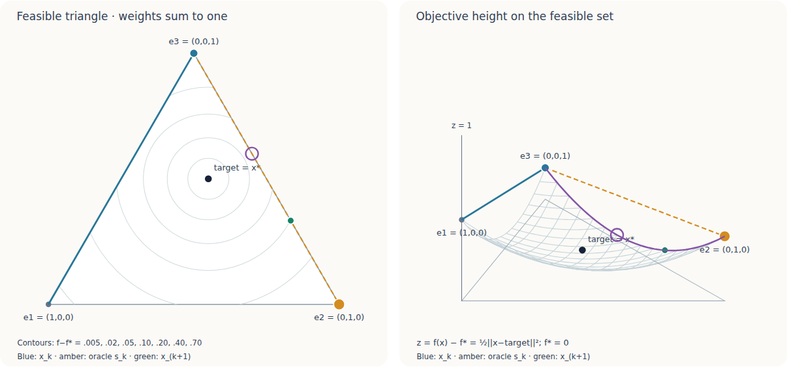
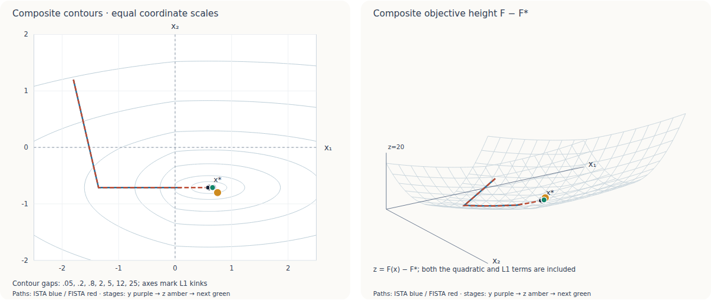
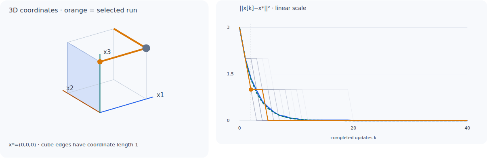
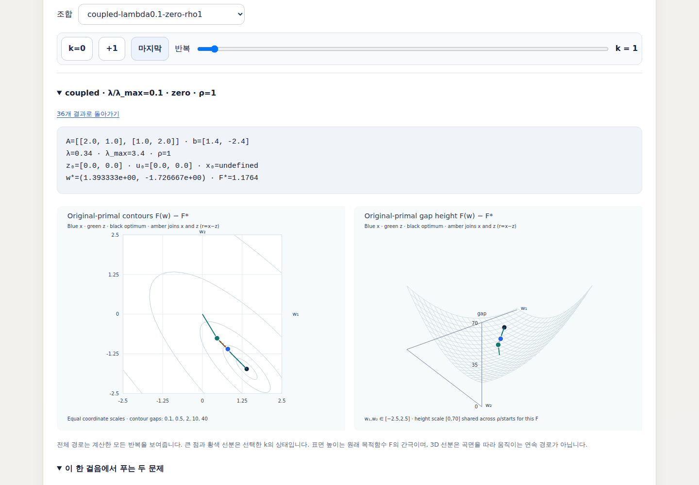

# 실제 계산으로 보는 다섯 가지 기하 그림

아래 그림은 [통과한 GitHub 브라우저 검사](https://github.com/chocoemong17/chainbench/actions/runs/36878546485)에서 저장한 화면입니다. 소스는 `33b62430c98c94aa822fcf7101c03d458a7fb308`이며, [구현과 전체 예제 실행 방법](https://github.com/chocoemong17/chainbench/tree/33b62430c98c94aa822fcf7101c03d458a7fb308)을 함께 확인할 수 있습니다. 원본 화면 다섯 장과 해시를 보존합니다.

이 모음은 그림 읽기를 돕는 예시입니다. 성능 순위를 정하기 위해 뽑은 표본이 아닙니다. 전체 HTML 보고서에는 추가 사례와 수치 기록이 있으며, 원 논문의 주장과 교육용 예제의 범위를 구분합니다. 아래 3D 목적함수 그림에서 높이는 별도의 최적화 변수가 아니라 함수값을 나타냅니다. Kaczmarz 정육면체는 실제 3차원 상태 공간입니다.

## Frank–Wolfe: 삼각형 안에서 꼭짓점 방향으로 이동

왼쪽 삼각형은 세 좌표의 합이 1인 simplex를 펼친 것입니다. 현재 점에서 선형 목적을 가장 작게 만드는 꼭짓점을 찾고, 그 꼭짓점 방향으로 한 번 이동합니다. 오른쪽은 같은 점들 위에 목적함수 높이를 올린 그림입니다. `interior-e1` 사례의 한 단계를 보여 줍니다.

## ISTA와 FISTA: 기울기 이동, 임계값 처리, 가속

등고선과 높이 그림은 동일한 합성 목적함수를 나타냅니다. 알고리즘이 저장한 경로와 현재 단계의 중간 점을 비교할 수 있습니다. 이 화면은 브라우저 검사에서 선택한 FISTA 단계입니다. FISTA의 목적함수는 매 단계 반드시 감소하지 않으므로 한 화면만으로 수렴 속도를 판단하지 않습니다.

## Kaczmarz: 한 행의 방정식이 정하는 평면으로 투영

정육면체 그림은 행을 선택한 뒤 상태가 바뀌는 실제 3차원 예제입니다. `cube`, seed 0, k=2 화면입니다. 옆의 여러 시행 경로를 함께 보면 한 번의 무작위 경로와 기대 오차에 대한 주장이 다르다는 점을 확인할 수 있습니다.

## ADMM: x, z, u가 맡는 역할을 나누어 보기

`coupled-lambda0.1-zero-rho1` 사례의 첫 업데이트입니다. 원래 목적함수의 높이와 분리된 변수들의 위치를 함께 표시합니다. 입력값과 잔차를 보고 각 변수가 같은 역할을 하지 않는다는 점을 읽을 수 있습니다. 이 그림은 모든 ADMM 설정의 성능을 대표하지 않습니다.

## Steepest descent와 conjugate gradient: 같은 문제, 다른 방향

Shewchuk 예제의 실제 궤적을 등고선과 3D 높이로 비교합니다. 아래쪽 패널은 각도, 오차 에너지와 스펙트럼 관점을 연결합니다. CG가 이 2차원 예제에서 계산을 끝낸 뒤에는 마지막 점을 유지해서 표시하며, 이후 점을 새 계산으로 세지 않습니다. 원문의 예제 위에 교육용 패널을 더한 것으로, 원 논문의 그림을 복사한 것이 아닙니다.

원본 artifact는 `11170642611`입니다. 압축 파일의 SHA-256과 각 PNG의 크기·해시는 [evidence.json](evidence.json)에 기록되어 있습니다. 브라우저 검증 스크립트는 같은 소스 커밋의 `scripts/check_*_browser.py`에 있습니다. 화면은 직접 확인했으며, 독립된 외부 리뷰를 받았다는 의미는 아닙니다.
