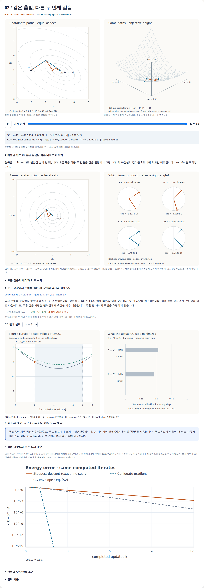
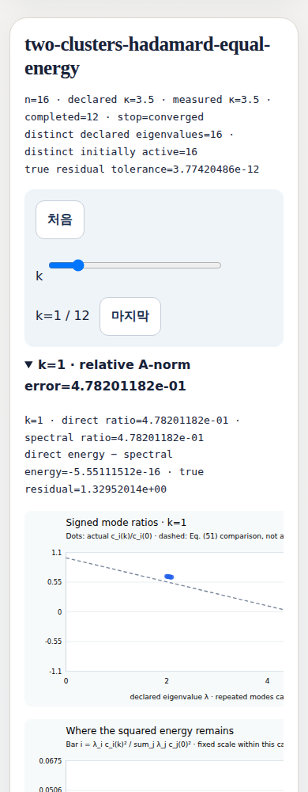

# CG 계산 수정 후의 실제 화면

이 두 화면은 수정 커밋 `b857694bbdd4f314bbe2bf2d05629af02d829023`을
GitHub Actions에서 계산·렌더링한 결과입니다.
[브라우저 검증 실행](https://github.com/chocoemong17/chainbench/actions/runs/36897340879/job/110487530371)에서
1440px·390px, 모든 선언된 사례와 반복 상태, 오프라인·키보드·스크립트 없는 읽기를 검사했습니다.
이 실행의 브라우저 작업은 통과했습니다. 전체 CI는 7개 작업 통과와 macOS의
1개 테스트 실패(1,332개 통과)를 기록했습니다. 실패는 HTML 저장값을 별도의 GD
재계산과 완전 일치로 비교한 테스트였으며, CG 회귀검사는 모두 통과했습니다.

## 같은 시작점에서 달라지는 SD·CG 경로

Shewchuk의 명시된 2차원 예제를 다시 계산한 화면입니다.
CG는 두 번의 업데이트 뒤 실제 종료 상태를 유지하며, 추가 반복점을 만들지 않습니다.
원래 좌표의 경로와 목적함수 높이, A-내적에서의 방향, 실제 고유성분 오차를 함께 읽을 수 있습니다.

## 좁은 화면에서 읽는 CG 고유성분

18개 선언된 입력 중 `two-clusters-hadamard-equal-energy`의 k=1 화면입니다.
화면에 실제 차원·조건수·종료 기준과 오차가 표시됩니다. 그래프 영역은 가로 스크롤로
전체 축을 읽으며, 키보드 스크롤도 브라우저 검사에서 확인했습니다.
한 화면은 대표성의 증거가 아니며, 전체 보고서에는 모든 입력과 계산 행이 남아 있습니다.

[수치 수정의 원인과 범위](https://github.com/chocoemong17/chainbench/blob/b857694bbdd4f314bbe2bf2d05629af02d829023/docs/CG_ARITHMETIC.md)를
함께 읽어주세요. 내적 합산만 바뀌었고 비교 허용치와 종료 기준은 유지했습니다.
일부 유한 CG 경로는 이전 빌드와 달라질 수 있습니다.

두 PNG를 실제로 열어 확인했습니다. [evidence.json](evidence.json)은 소스 트리,
원격 artifact 및 파일별 SHA-256을 기록합니다. 이 기록은 자체 검증이며 외부 독자의 평가를
대신하지 않습니다.
