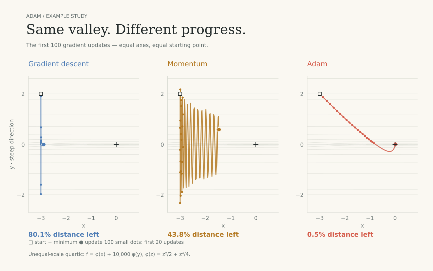
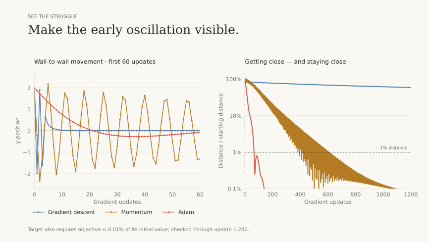

# Adam example review

English · [한국어](README.ko.md)

A nonlinear valley with very different scales in its two directions.
Adam adjusts each direction's step size: less wall-to-wall motion, more progress toward the minimum.

| Method | Updates to the target | Learning rate | Momentum |
|---|---:|---:|---:|
| Gradient descent | > 1,200 | 3.9810717e-05 | 0 |
| Momentum | 611 | 2.2067341e-05 | 0.985935 |
| Adam | 66 | 0.14 | 0.9 |

The target requires **both** distance ≤ 1% of its starting value and objective ≤ 0.01% of its starting value,
remaining there through update 1,200. Equal full-gradient counts, not wall-clock speed.

Adam uses a round learning rate of 0.14; each baseline uses its best found central setting.
This constructed example shows why coordinate-wise normalization can help.
Rotation or a well-scaled function can change the ranking; all 27 cases are in [the table](case-summary.csv).

Starting points, tuning and exact evidence

### Nearby starts with the same settings

| Start | GD | Momentum | Adam |
|---|---:|---:|---:|
| [-2.4, 1.6] | > 1,200 | > 1,200 | 89 |
| [-3.6, 2.4] | diverged | diverged | 164 |
| [-3, 1] | > 1,200 | 643 | 77 |
| [-2, 3] | diverged | diverged | 66 |

The aggressive baseline settings selected on the central start can fail elsewhere.
Retuning each nearby start in the broad grid gives the following results:

| Start | GD | Momentum | Adam |
|---|---:|---:|---:|
| [-2.4, 1.6] | > 1,200 | 688 | 65 |
| [-3.6, 2.4] | > 1,200 | 959 | 71 |
| [-3, 1] | > 1,200 | 471 | 76 |
| [-2, 3] | > 1,200 | > 1,200 | 67 |

These are declared sensitivity checks, not independent training benchmarks.
[Full candidate ledger](candidate-ledger.csv.gz): 80,407 tried settings, including failures.
The broad-grid table precedes central refinement; it is not a claim of globally optimal tuning.
The quartic coefficients differ by 10,000; this is not a constant global condition number.
Adam beta1=0.9, beta2=0.999, epsilon=1e-8; both bias corrections; zero initial moments.
Momentum: b ← beta·b + gradient; x ← x − alpha·b; b starts at zero.
The original paper: [Kingma & Ba, Algorithm 1 and §2.1](https://arxiv.org/abs/1412.6980v9).

Computed from source `d6be0eea39fe19638ee9d29f235bd8186d3909a0`. [Machine-readable paths and settings](proposal.json).

