# 다음 세 편 — 설명 방식과 난이도 검토용 1차 시안

[English](README.md) · [기존 완성 수업](https://chocoemong17.github.io/chainbench/papers/?lang=ko)

**완성 영상을 만들기 전에, 설명이 눈에 들어오는지 확인하는 시안입니다.**
각각 네 장면, 장면당 5초인 20초 그림입니다. GitHub에서 바로 볼 수 있습니다.
움직임이 빠르거나 불편하면 ‘정지 그림으로 천천히 보기’를 열어 주세요.

| 순서 | 추가 후보 | 기존 수업과의 연결 | 상태 |
| --- | --- | --- | --- |
| 1 | 역전파 | Adam이 받는 변화 신호, ResNet의 돌아오는 길 | 검토 대기 |
| 2 | CNN | ResNet이 다루는 시각적 특징, 위치마다 같은 탐지기 사용 | 검토 대기 |
| 3 | Dropout | 학습할 때 참여하는 특징 조합을 바꾸는 이유 | 검토 대기 |

완성된 수업은 **Adam·Attention·ResNet 세 편**입니다. 아래 후보를 완성 편수나
학생들이 검증한 콘텐츠로 집계하지 않습니다.

## 1. 역전파 — 어느 연결을 어떻게 고칠까?

예측이 목표와 다를 때, 앞에서 계산한 값을 활용해 각 연결이 오차에 미치는
영향을 거꾸로 계산합니다. 그 뒤 최적화 방법이 연결의 값을 바꿉니다.

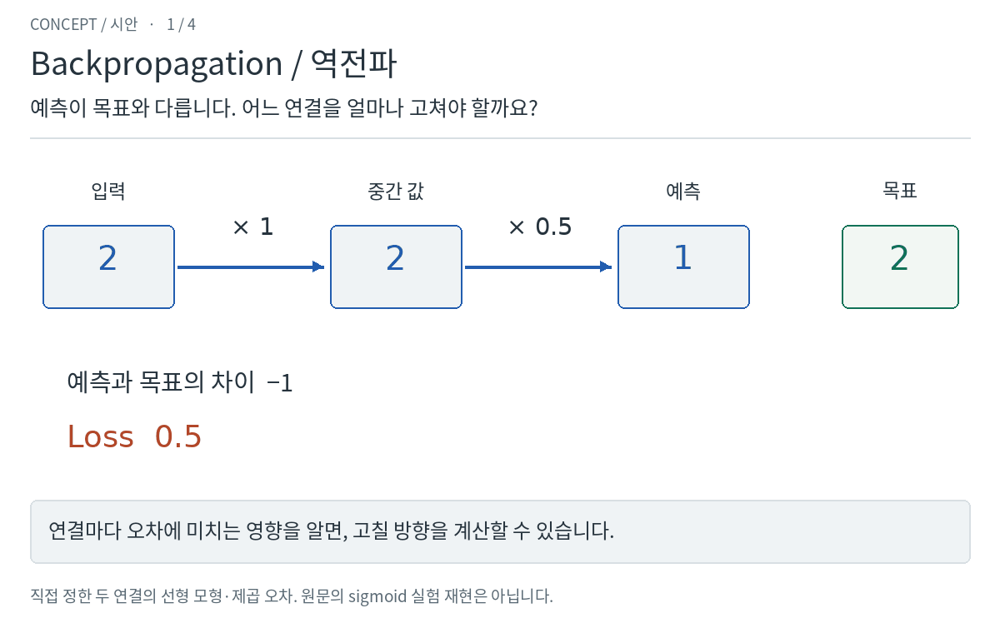

정지 그림으로 천천히 보기 — 네 장면 모두

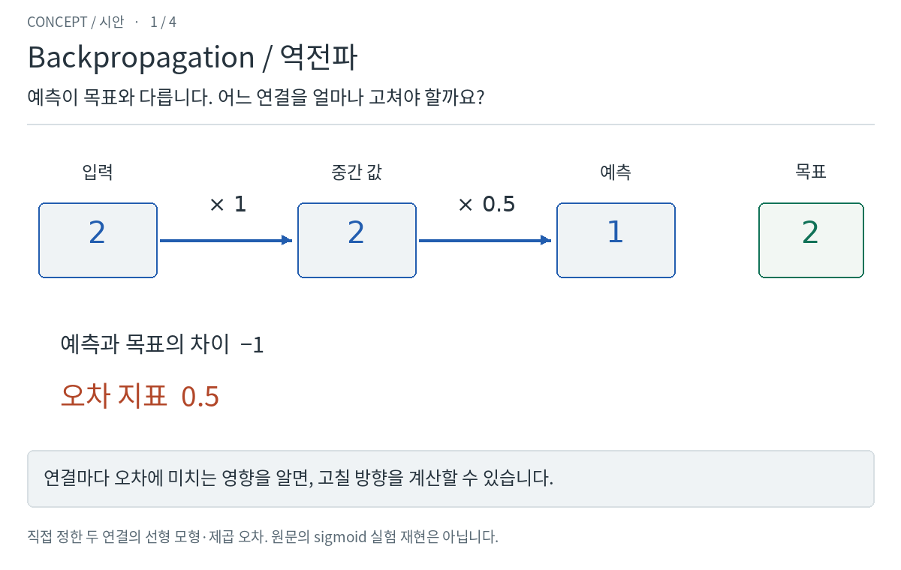
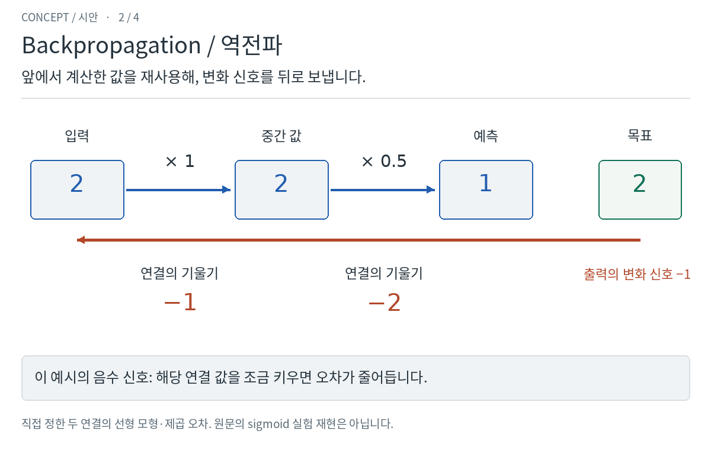
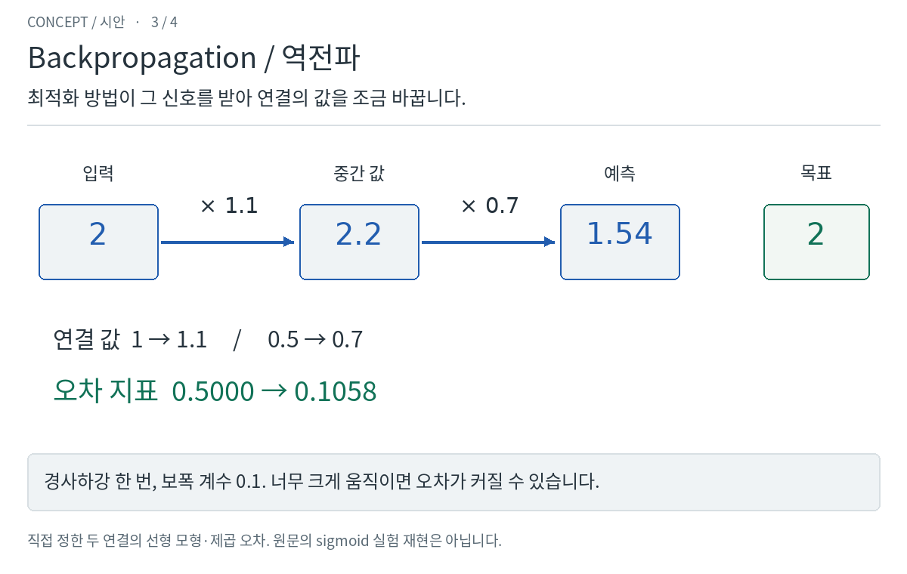
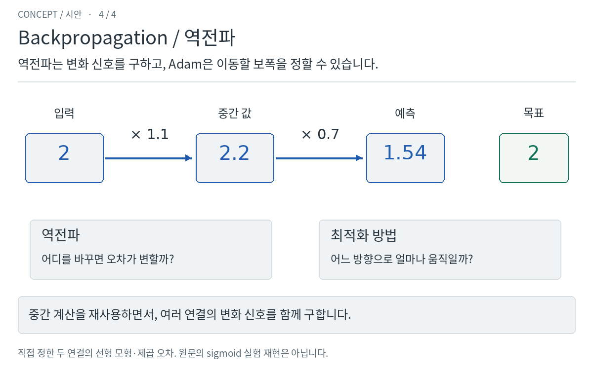

검토할 점: **거꾸로 계산하는 이유와 Adam과의 역할 차이가 보이나요?**
승인되면 단계별로 직접 넘기고 보폭을 조절하도록 만듭니다.
보폭이 너무 크면 오히려 나빠지는 경우도 포함할 계획입니다.

[원문](https://doi.org/10.1038/323533a0) · [예시의 정확한 조건](BRIEF.md#1-backpropagation--priority-one)

## 2. CNN — 같은 무늬를 여러 위치에서 찾기

작은 탐지기를 그림 위에서 반복해서 사용합니다. 무늬를 옮기면 반응하는 위치도
옮겨지고, 탐지기를 바꾸면 다른 무늬에 반응합니다. 연결 값을 공유하므로
위치마다 모든 값을 새로 배울 필요가 줄어듭니다.

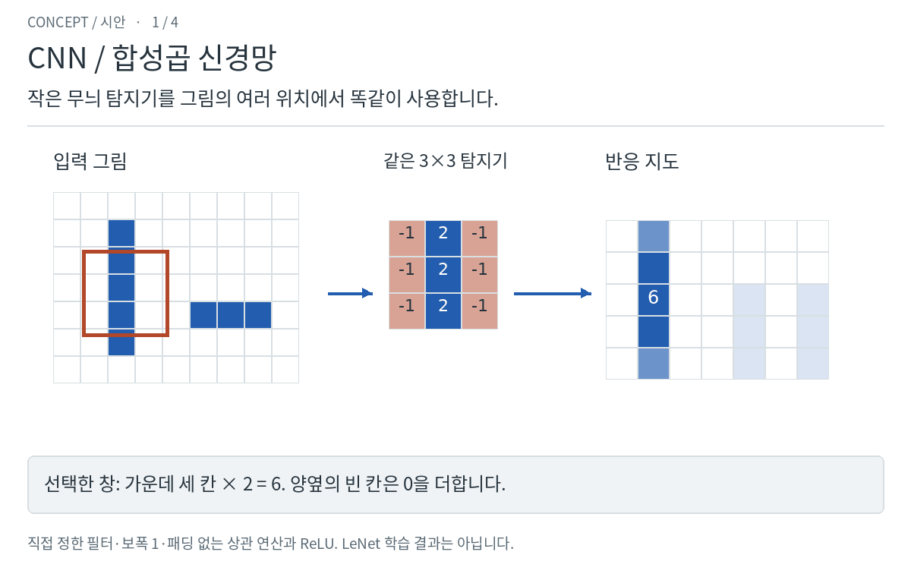

정지 그림으로 천천히 보기 — 네 장면 모두

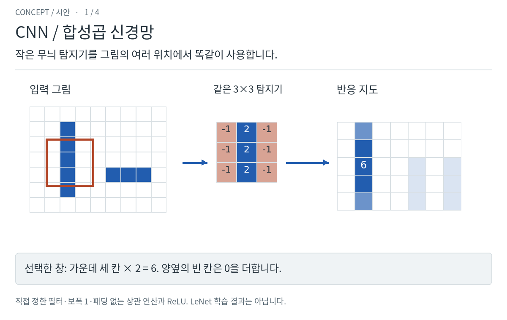
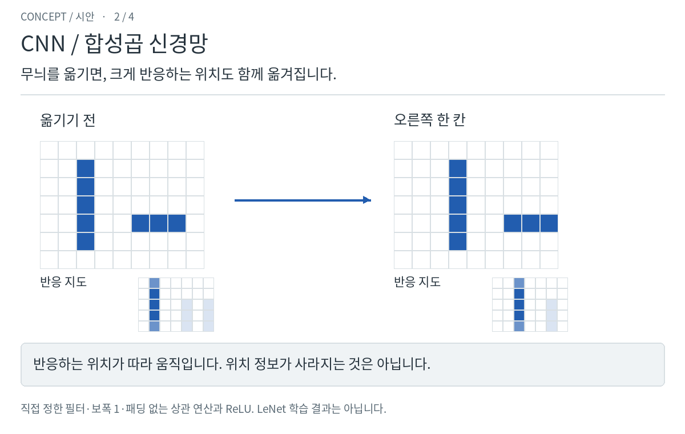
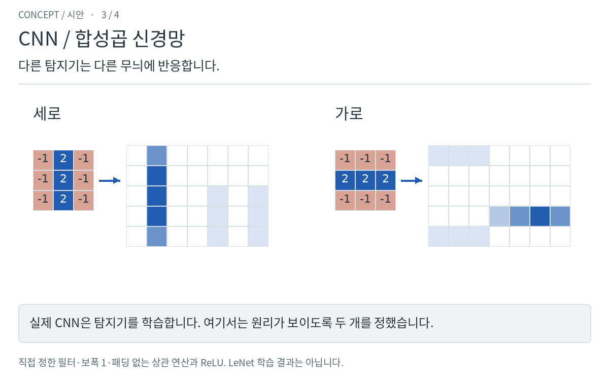
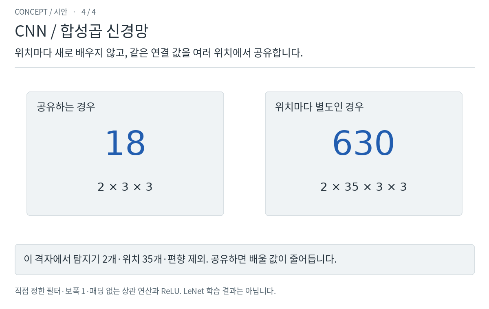

검토할 점: **‘같은 탐지기를 여러 위치에서 사용한다’는 특징이 눈에 보이나요?**
승인되면 창과 무늬를 직접 움직이도록 만듭니다. 실제 CNN은 탐지기를 학습하며,
여기서는 설명이 잘 보이도록 탐지기를 정해 두었습니다.

[원문·저자 페이지](https://bottou.org/papers/lecun-98h) · [예시의 정확한 조건](BRIEF.md#2-cnn--priority-two)

## 3. Dropout — 학습할 때 일하는 조합을 바꾸기

늘 같은 조합에만 기대지 않도록, 학습할 때 일부 특징을 잠깐 쉬게 합니다.
다음에는 다시 참여할 수 있고, 예측할 때는 모두 사용하며 크기를 조절합니다.

정지 그림으로 천천히 보기 — 네 장면 모두

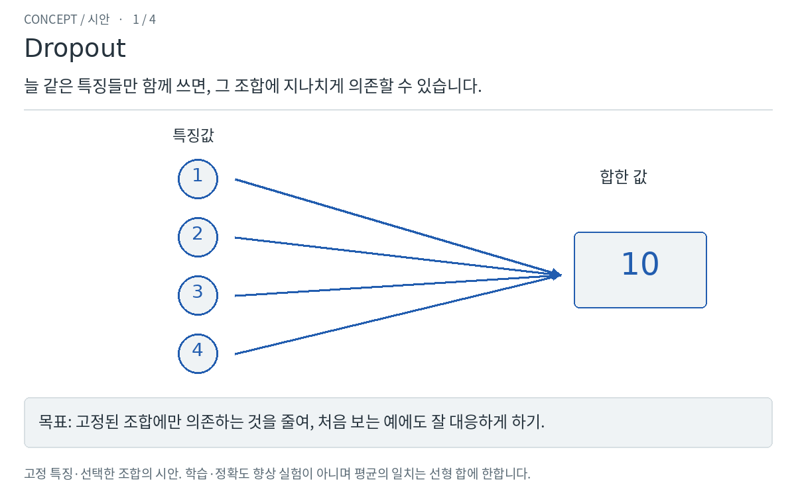
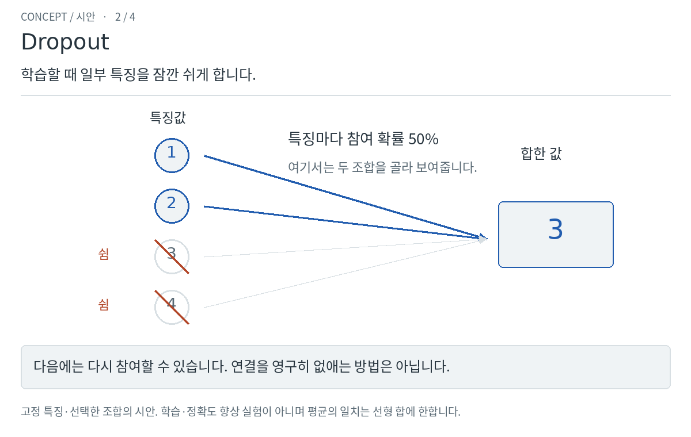
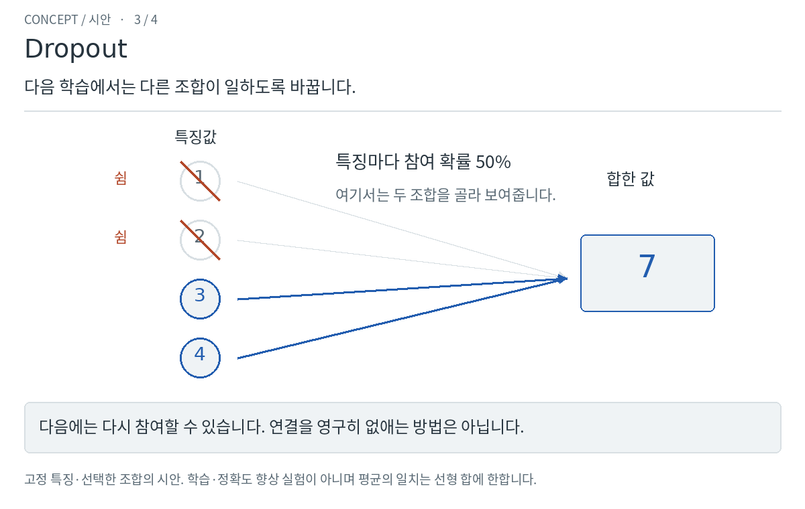
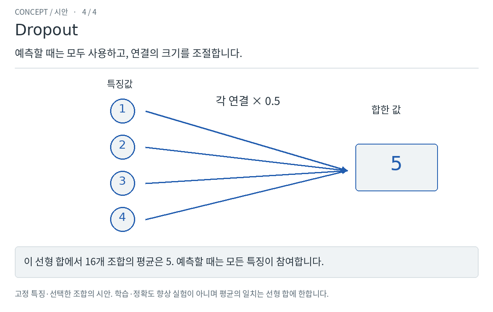

검토할 점: **연결을 영구히 없애는 것이 아니라 학습 중 참여 조합을 바꾼다는 점이 보이나요?**
승인되면 여러 조합을 살펴보고 예측 모드로 바꾸도록 만듭니다.
이 작은 모형은 원리를 보여주며, 정확도가 실제로 향상됐다는 실험은 아닙니다.

[원문](https://jmlr.org/papers/v15/srivastava14a.html) · [예시의 정확한 조건](BRIEF.md#3-dropout--priority-three)

## 이번에 확인받을 것

각각 **진행해도 됨 / 수정 필요**, 난이도는 **쉬움 / 적당함 / 어려움**으로
말씀해 주시면 됩니다. 막히는 장면이 있으면 그 부분만 짚어 주세요.
한 편씩 따로 승인해도 됩니다. **승인된 주제만 완성 영상·화면으로 정교화합니다.**

[기여자용 양식](../../templates/LESSON_BRIEF.md) ·
[수업 추가 절차](../../LESSON_AUTHORING.ko.md) ·
[피드백과 개선 기록](../../FEEDBACK_ACTIONS.ko.md) ·
[클라우드 계산·이미지 검증 기록](v1/verification.json)
