# Three next lessons — concept review, revision 1

[한국어](README.ko.md) · [Existing finished lessons](https://chocoemong17.github.io/chainbench/papers/)

**Review the idea and difficulty before we make the finished films.** These are
four-scene sketches, 20 seconds each, with a five-second hold per scene. The
images below open directly in GitHub; no download or installation is needed.
Open “Read at your own pace” for stills if animation is too fast or distracting.

| Order | Proposed addition | What it helps explain | Status |
| --- | --- | --- | --- |
| 1 | Backpropagation | Where Adam's change signals come from; ResNet's backward route | Awaiting your review |
| 2 | CNN | Local pattern detection and shared weights; ResNet's visual features | Awaiting your review |
| 3 | Dropout | Varying the participating units while learning | Awaiting your review |

Adam, Attention and ResNet are the **three finished lessons**. These sketches are
not new finished lessons or additional classroom-tested material.

## 1. Backpropagation — find what to change

A prediction misses its target. Reusing the forward calculations tells us how
each connection affects the loss. An optimizer then makes a small update.

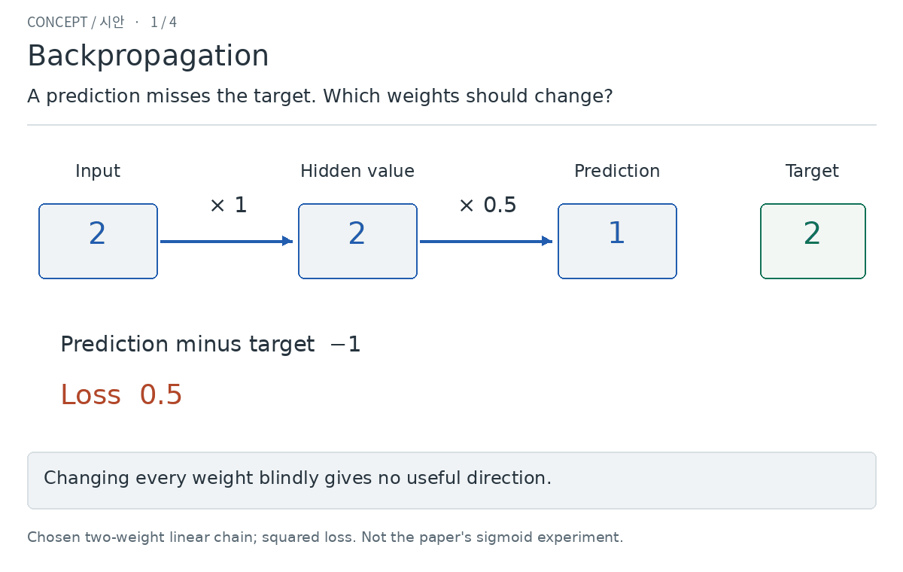

Read at your own pace — all four scenes

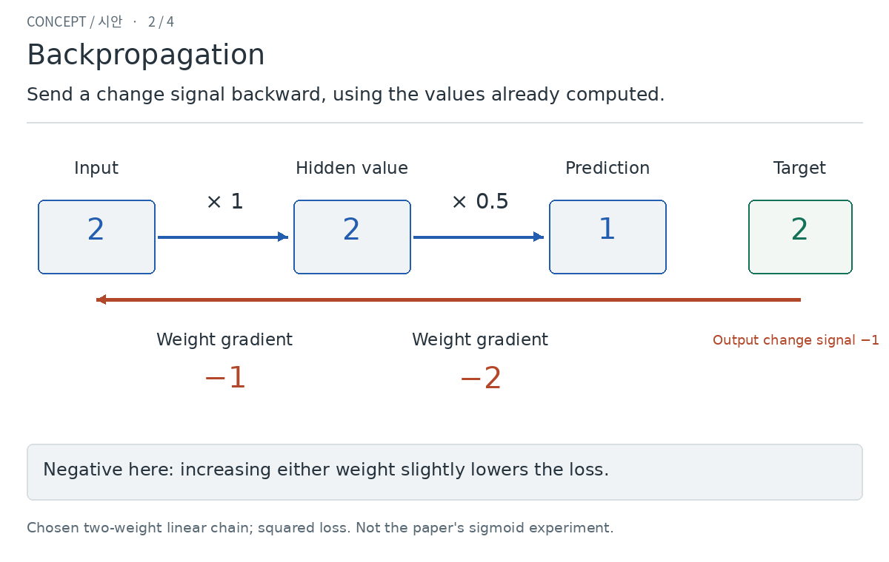
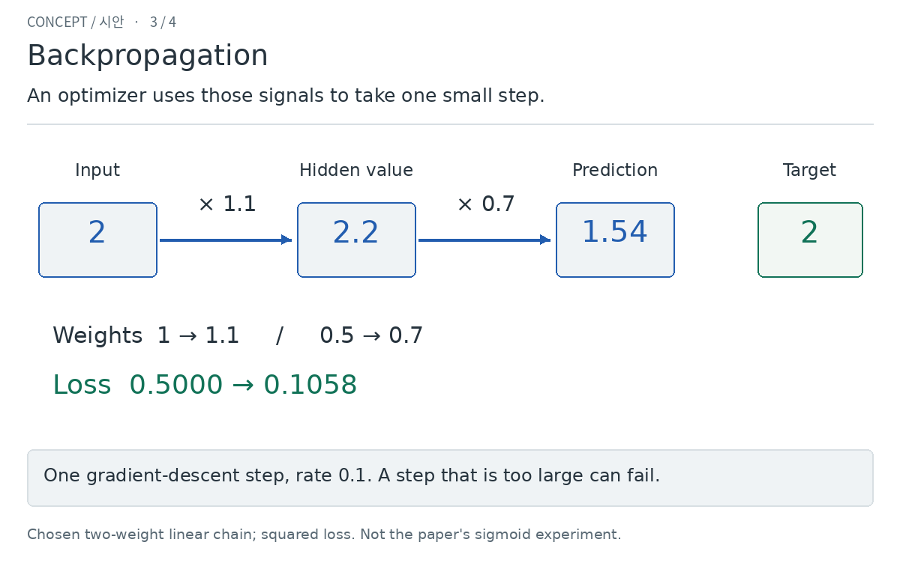
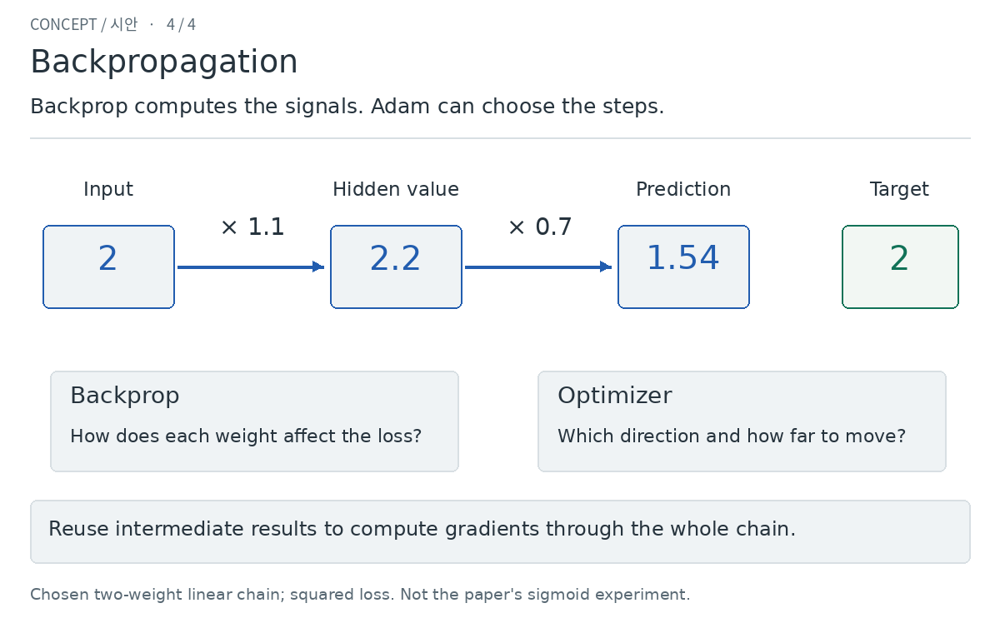

Review focus: **Can you see why a backward calculation is useful, and how it
differs from Adam?** If approved, the final lesson will let you step through the
process and vary the update size, including a size that makes the loss worse.

[Original paper](https://doi.org/10.1038/323533a0) ·
[Exact example and limits](BRIEF.md#1-backpropagation--priority-one)

## 2. CNN — recognize a pattern at different positions

The same small detector moves over a picture. Its response follows the pattern;
another detector finds a different pattern. Reusing weights reduces how many
separate values must be learned.

Read at your own pace — all four scenes

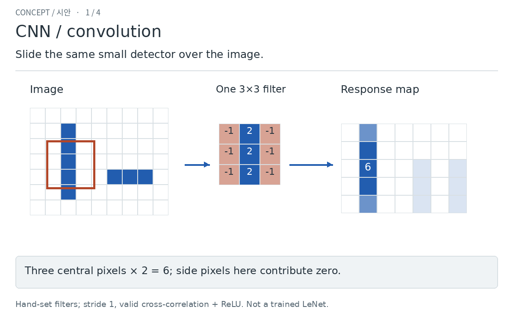
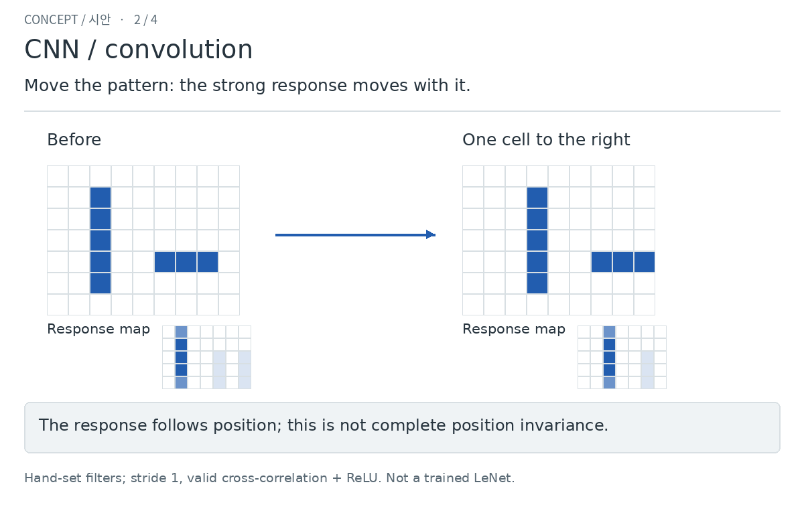
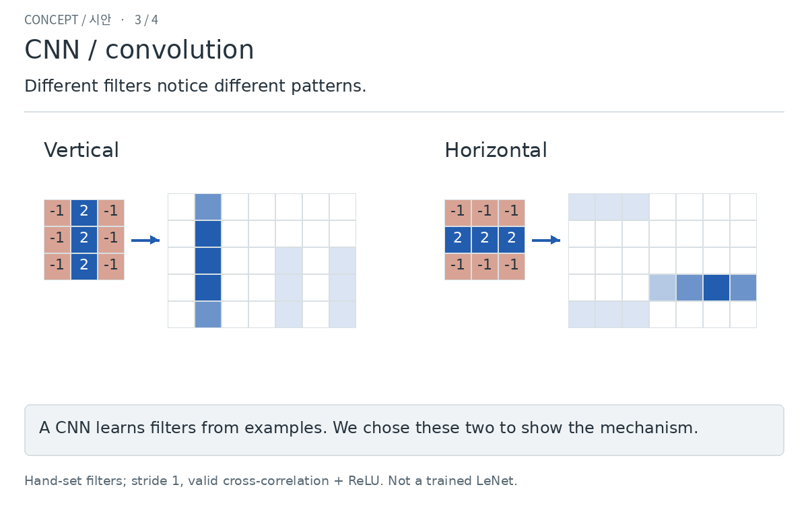
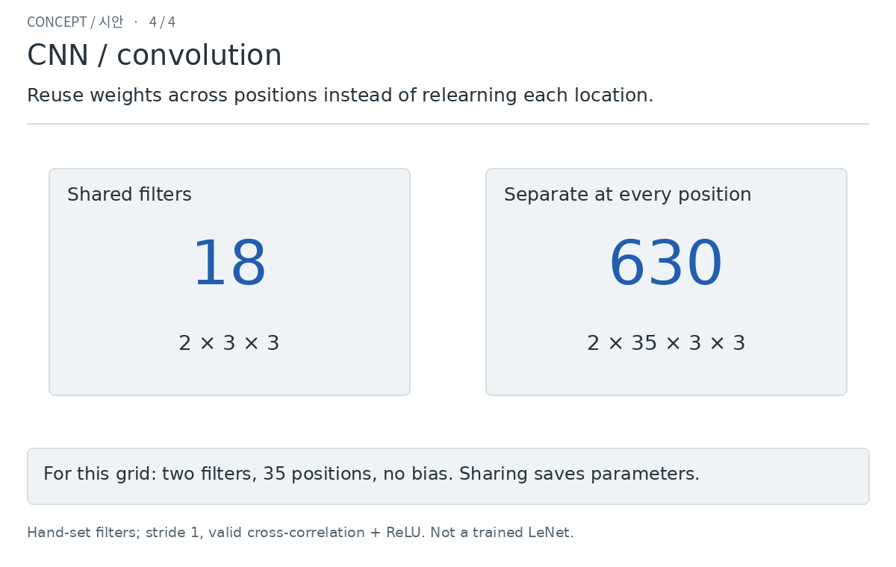

Review focus: **Does reusing the same detector across positions make sense?**
If approved, drag the window and move the pattern in the final lesson. These
filters are chosen for explanation; a real CNN learns its filters.

[Original paper, author's page](https://bottou.org/papers/lecun-98h) ·
[Exact example and limits](BRIEF.md#2-cnn--priority-two)

## 3. Dropout — let different combinations take part

During training, temporarily omit some units so the network cannot always rely
on one fixed team. Units can return next time. Prediction uses all units with
the paper's weight scaling.

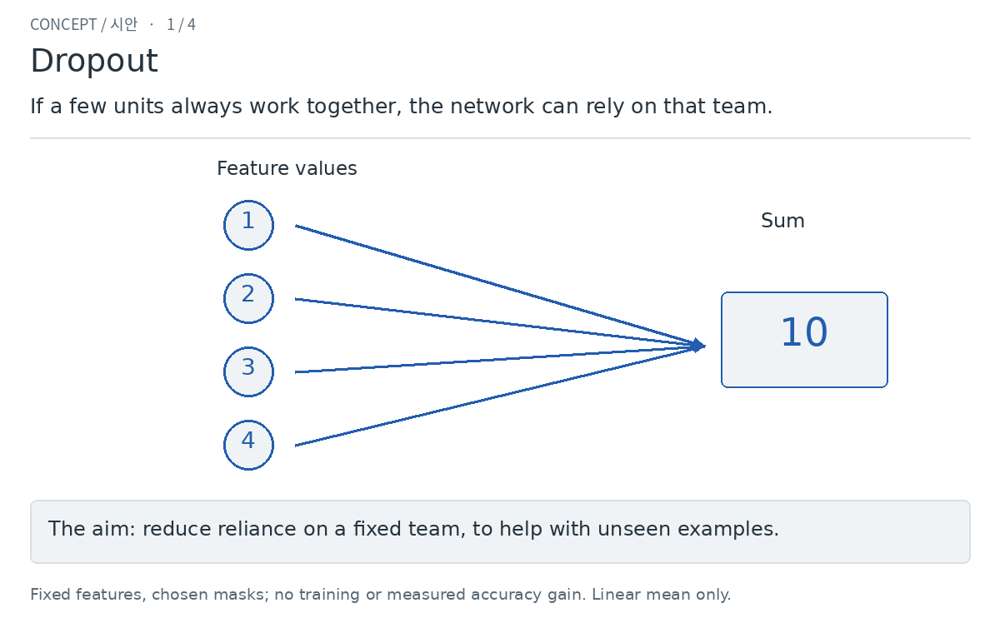

Read at your own pace — all four scenes

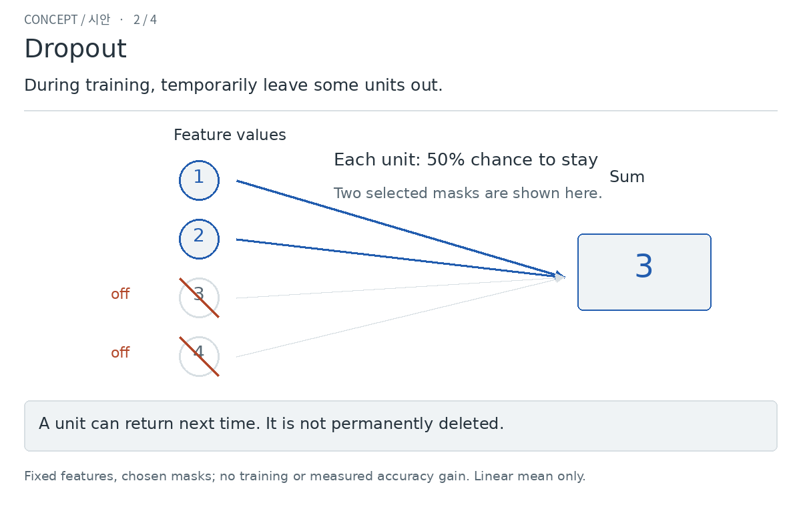
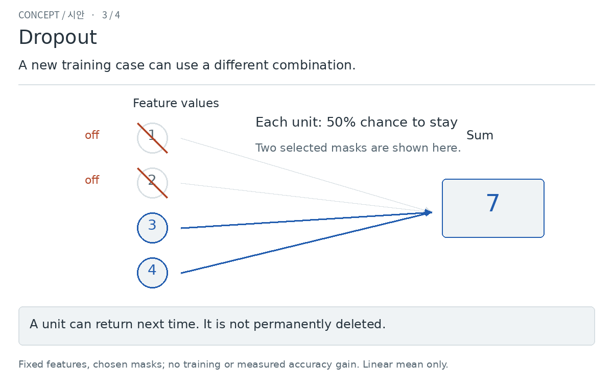
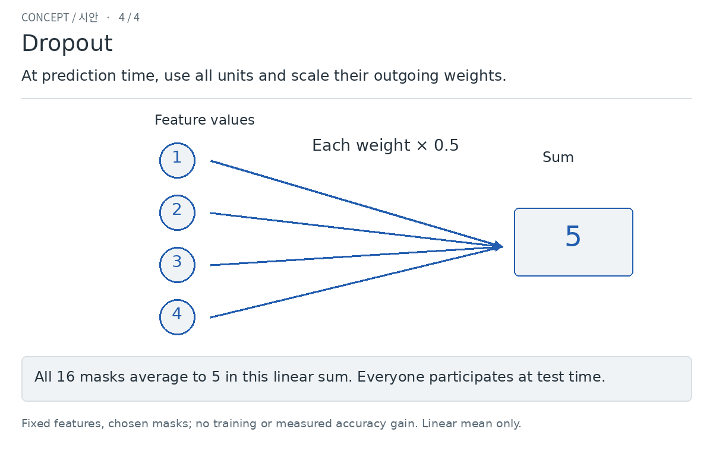

Review focus: **Is it clear that this changes participation during training,
and does not permanently delete units?** If approved, inspect different masks
and switch to prediction mode. This small sum shows the mechanism; it does not
demonstrate a measured accuracy improvement.

[Original paper](https://jmlr.org/papers/v15/srivastava14a.html) ·
[Exact example and limits](BRIEF.md#3-dropout--priority-three)

## What to review

For each topic: **approve / needs a change**, plus **too easy / about right / too
hard**. A short note about a confusing scene is enough. Topics can be approved
separately. No final video or production-page work starts for a topic until its
explanation and difficulty are approved.

[Contributor template](../../templates/LESSON_BRIEF.md) ·
[Authoring steps](../../LESSON_AUTHORING.md) ·
[Feedback and changes](../../FEEDBACK_ACTIONS.md) ·
[Cloud calculation and image checks](v1/verification.json)
