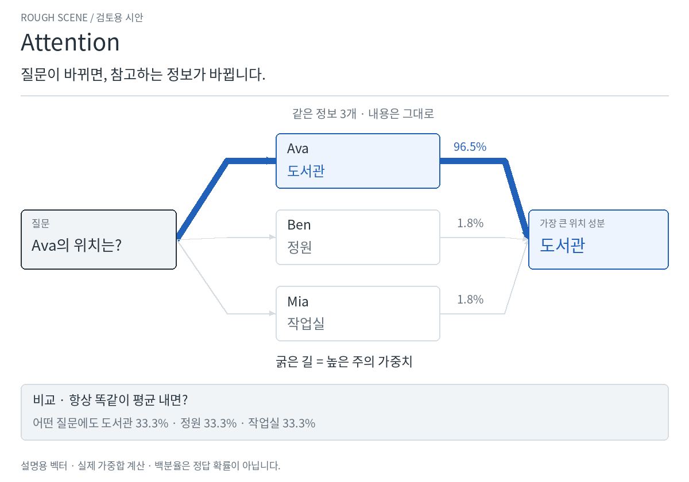
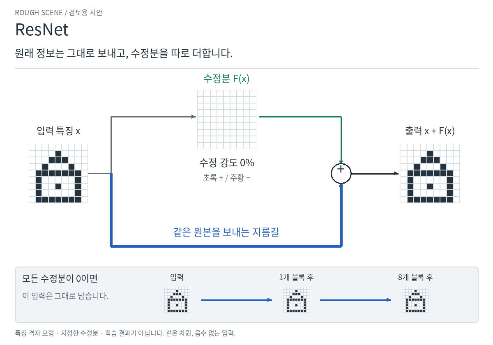

# 방법별 핵심 장면 — 정교화 전 검토용

[English](README.md)

**지금은 연출 시안입니다. 화면의 완성도보다 각 방법의 특징이 보이는지 봐 주세요.**

## Attention · 질문을 바꾸면 참고하는 정보가 바뀝니다

같은 세 사람의 위치 정보에서 Ava를 물었다가 Mia를 묻습니다.
굵은 연결선과 답이 함께 바뀝니다. 모든 정보를 똑같이 평균 내면 이 구분이 사라집니다.

[정지 화면](attention.ko.png)

확인할 점: **“질문에 맞춰 필요한 정보를 더 많이 가져온다”는 특징이 보이나요?**

## ResNet · 원래 정보는 보내고, 수정분을 따로 더합니다

아래 길로 원래 격자를 그대로 보냅니다. 위쪽 가지는 고칠 칸만 보탭니다.
수정분이 0이면 이 블록을 더 쌓아도 이 입력은 그대로 남습니다.

[정지 화면](resnet.ko.png)

확인할 점: **“원래 정보를 보내는 길”과 “수정분을 만드는 길”이 구분되나요?**

두 장면을 각각 승인하거나 바꾸고 싶은 점을 알려 주세요.
사용자가 요청한 순서에 따라 **승인 후에 영상·상호작용·최종 디자인을 정교하게 제작**합니다.

시안이 보여주는 범위

Attention은 논문의 실제 가중합 식으로 계산하지만, 이름과 위치 벡터는 설명용으로
지정했습니다. 학습된 언어 이해나 Transformer 전체를 보여주는 것은 아닙니다.
백분율은 주의 가중치이며 정답 확률이 아닙니다. 평균 비교는 특정한 고정 평균 방식입니다.

ResNet의 격자는 특징 정보를 설명하는 모형입니다. 삭제 1칸·추가 2칸의 수정분을
지정하여 덧셈과 ReLU를 계산했습니다. 실제 이미지 복원 학습 결과가 아닙니다.
수정분 0에서 입력을 보존하는 장면은 같은 차원과 음수가 없는 입력 조건입니다.
일반 신경망도 항등함수를 배우면 입력을 보존할 수 있습니다. 잔차 가지에서는
같은 목표를 0으로 표현할 수 있다는 차이를 보여줍니다.

루프의 장면 전환은 학습 시간이나 학습 속도 비교가 아닙니다.
[정확한 식·원문·재현 코드](README.md#exact-meaning-and-sources)를 함께 남겼습니다.

