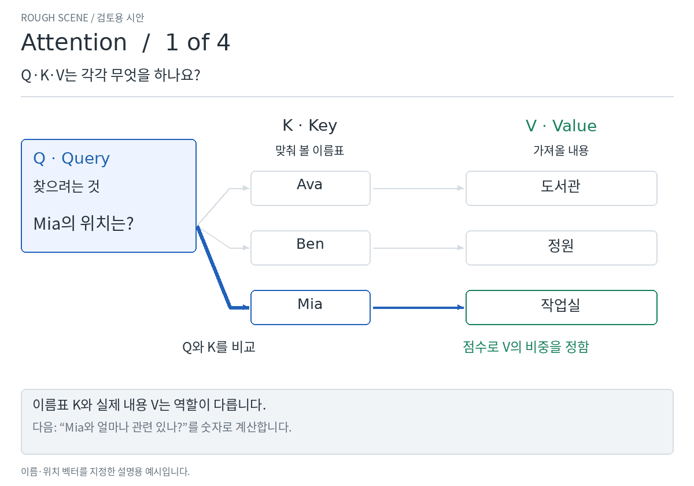
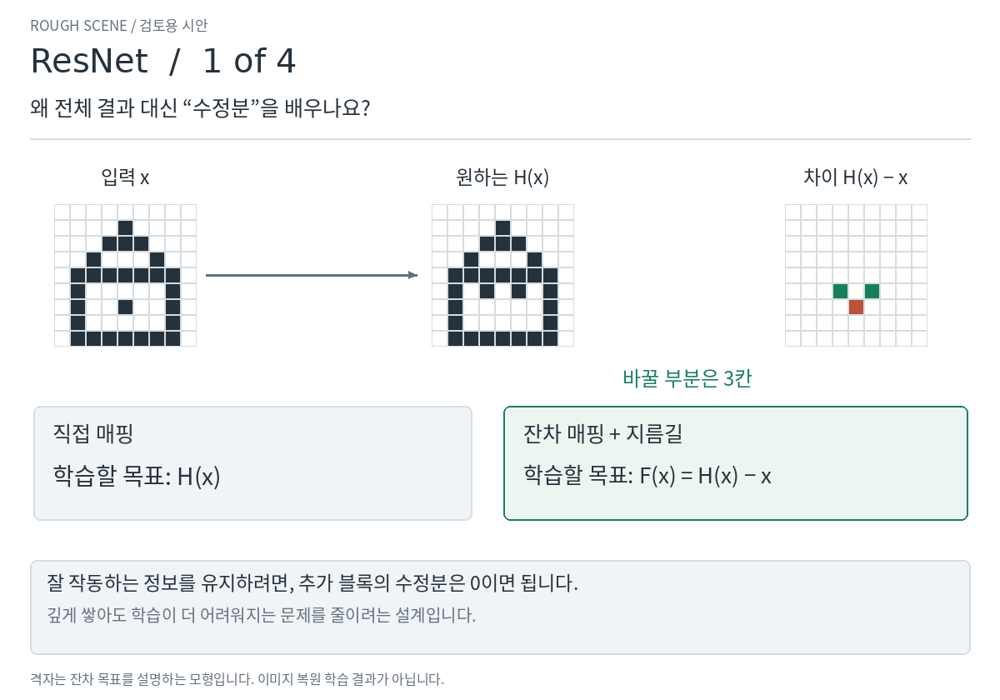

# Attention·ResNet 설명 보강 시안 · 2차

[English](README.md)

이번에는 각 방법을 **네 장면**으로 나눠 “무엇을 하는지 → 어떻게 계산하는지 → 왜 도움이 되는지”를 연결했습니다.
아래는 30초짜리 설명 시안입니다. 천천히 읽으려면 표의 **번호별 정지 화면**을 여세요.

## Attention · 질문으로 정보를 모으는 과정을 따라갑니다

| 장면 | 이해할 내용 |
| --- | --- |
| [1 · Q·K·V의 역할](v2/attention.ko.1.png) | Q는 찾으려는 것, K는 맞춰 볼 이름표, V는 가져올 내용입니다. |
| [2 · 점수 → 비중](v2/attention.ko.2.png) | Q와 각 K를 비교해 점수를 만들고, softmax로 합이 1인 비중을 구합니다. |
| [3 · 내용을 가중합](v2/attention.ko.3.png) | 각 V에 비중을 곱해 모두 더합니다. 한 줄을 선택하고 끝나는 구조가 아닙니다. |
| [4 · Self-attention·여러 head](v2/attention.ko.4.png) | 각 단어가 Q·K·V를 만들고 다른 단어를 참고합니다. 여러 head는 서로 다른 변환으로 정보를 모읍니다. |

“Mia의 위치는?”이라는 질문에서 Mia의 이름표가 높은 점수를 받으면,
작업실 정보가 출력에 많이 반영됩니다. 질문을 Ava로 바꾸면 같은 정보에서도 비중이 달라집니다.
마지막 장면은 이 계산이 실제 Transformer의 구조와 어떻게 이어지는지 보여줍니다.

## ResNet · 수정분을 배우고, 학습 신호를 뒤로 보냅니다

| 장면 | 이해할 내용 |
| --- | --- |
| [1 · 왜 수정분을 배우나](v2/resnet.ko.1.png) | 원본은 지름길로 보내고 가지는 차이 H(x)−x를 배웁니다. 유지하고 싶으면 수정분은 0이면 됩니다. |
| [2 · 순전파](v2/resnet.ko.2.png) | 입력 2.0에 수정분 0.1을 더해 2.1을 예측합니다. 정답 2.2보다 조금 작습니다. |
| [3 · 역전파의 두 경로](v2/resnet.ko.3.png) | 값을 조금 바꾸면 오차가 어떻게 달라지는지 나타내는 기울기를 뒤로 보냅니다. 두 경로의 기여를 합칩니다. |
| [4 · 깊어지면 무엇이 달라지나](v2/resnet.ko.4.png) | 지정한 숫자 모형에서 앞쪽 특징까지 전달되는 기울기를 비교합니다. 실제 학습 속도 비교는 아닙니다. |

역전파 장면에서는 오차에서 **−0.10**의 신호가 돌아옵니다.
지름길은 **−0.10**, 가지는 **+0.01**을 전달하여 앞쪽에는 **−0.09**가 도달합니다.
가지의 가중치도 계속 학습합니다. 지름길의 이점은 작은 미분값들을 계속 곱하는 경로에만 의존하지 않아도 된다는 것입니다.

다만 ResNet이라고 기울기가 항상 살아남는 것은 아닙니다.
상쇄나 꺼진 ReLU 때문에 0이 될 수 있다는 조건도 표시했습니다.

**검토할 점:** Attention은 비중이 어떻게 생겨서 어디에 쓰이는지 이해되나요?
ResNet은 지름길이 역전파에 무엇을 보태는지 이해되나요?
각각 승인하거나, 아직 설명이 부족한 장면을 알려 주세요. 승인 후에 최종 영상과 상호작용을 정교화하겠습니다.

예시의 범위와 원문

Attention의 이름·위치 벡터는 설명을 위해 지정했습니다. 실제 식으로 가중합을 계산하지만
학습된 언어 이해 결과는 아닙니다. Self-attention 장면도 구조도이며 문장의 실측 가중치가 아닙니다.

ResNet의 격자는 특징 정보의 모형입니다. 숫자 예시는 명시한 두 층 가지와 활성 ReLU에서
미분을 직접 계산했습니다. 깊이 비교는 서로 다른 두 스칼라 매핑의 기울기 전달을 설명하며,
성능 우열을 입증하는 학습 실험은 아닙니다. 순전파·역전파와 깊이 비교의 설정은 구분했습니다.

- [Attention 원문: §3.2](https://arxiv.org/html/1706.03762v7#S3.SS2)
- [ResNet 원문: §§3.1–3.2](https://arxiv.org/html/1512.03385v1#S3)
- [후속 논문의 역전파 설명: §2, 식 (5)](https://arxiv.org/html/1603.05027v3#S2)
- [정확한 식·조건·재현 코드](README.md)
- [수치 검산 기록](v2/verification.json)

