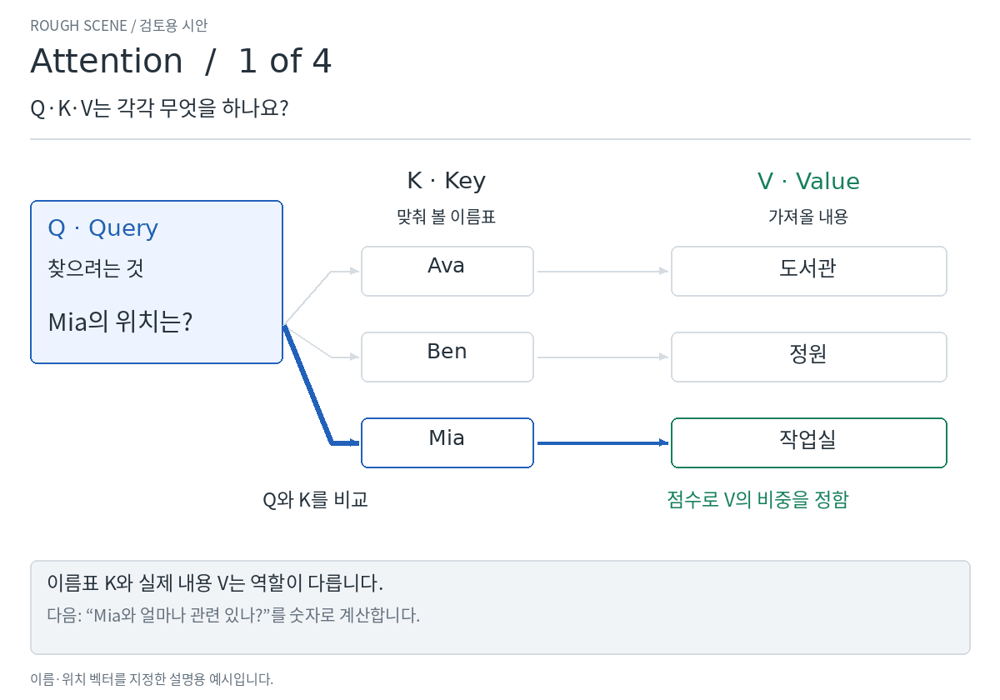
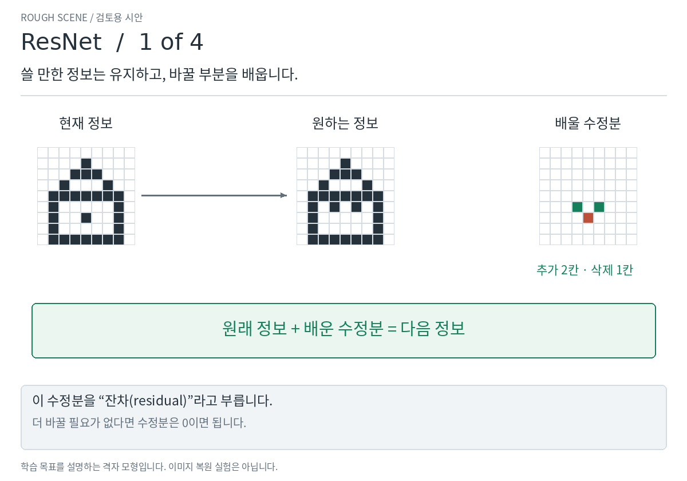

# Attention·ResNet — 원리를 따라가는 3차 시안

[English](README.md)

요청하신 **난이도 6 정도**를 목표로 조정했습니다.
핵심 용어와 작동 이유는 남기고, 벡터·지수·미분 계산은 아래 **자세히 보기**로 옮겼습니다.
각 시안은 30초이며, 표의 번호를 누르면 장면을 천천히 읽을 수 있습니다.

## Attention · 무엇을, 얼마나 참고할까?

| 장면 | 이해할 내용 |
| --- | --- |
| [1 · Q·K·V](v3/attention.ko.1.png) | 찾으려는 것, 맞춰 볼 이름표, 가져올 내용입니다. |
| [2 · 참고할 비중](v3/attention.ko.2.png) | 질문과 더 잘 맞으면 비중이 커집니다. Softmax는 점수를 이런 비중으로 바꿉니다. |
| [3 · 정보 모으기](v3/attention.ko.3.png) | 관련 정보는 많이, 다른 정보는 조금 모읍니다. 질문을 바꾸면 모이는 정보도 달라집니다. |
| [4 · 문장 속 관계](v3/attention.ko.4.png) | 단어들이 서로 참고합니다. 여러 head는 서로 다른 관계를 살필 수 있습니다. |

기억할 한 가지: **질문에 따라 각 정보를 참고하는 비중이 달라집니다.**

## ResNet · 무엇을 고치고, 고칠 방향은 어떻게 전달할까?

| 장면 | 이해할 내용 |
| --- | --- |
| [1 · 수정분 배우기](v3/resnet.ko.1.png) | 원래 정보는 보내고, 더하거나 뺄 부분을 배웁니다. |
| [2 · 예측하고 비교하기](v3/resnet.ko.2.png) | 2.0에 0.1을 더하면 2.1입니다. 정답 2.2보다 조금 작습니다. |
| [3 · 신호를 뒤로 보내기](v3/resnet.ko.3.png) | 기울기는 값을 바꿨을 때 오차가 어떻게 달라지는지 알려줍니다. 지름길은 신호가 돌아갈 경로를 보탭니다. |
| [4 · 앞쪽 층까지 닿기](v3/resnet.ko.4.png) | 간단한 숫자 모형으로 지름길이 학습 신호 전달에 어떻게 도움이 될 수 있는지 봅니다. |

기억할 한 가지: **지름길은 정보를 앞으로 보내고, 학습 신호가 뒤로 돌아가는 것도 돕습니다.**
가지의 학습도 계속 진행됩니다. 모든 상황에서 신호가 보존된다는 뜻은 아닙니다.

**이번 설명이 원하신 난이도에 가까운지 봐 주세요.**
여전히 어렵거나 너무 쉬운 장면 번호를 알려 주시면 그 부분을 조정하겠습니다. 승인 후에 정교화합니다.

자세히 보기 · 정확한 계산과 예시의 범위

**Attention:** 같은 예시의 실제 가중치를 정수로 반올림해 2%·2%·96%로 표시했습니다.
이 비중은 정답 확률이 아닙니다. 이름과 위치는 설명용으로 지정한 벡터입니다.
“누가/어디에서” 그림도 관계 설명을 위한 예시이며, 실제 head의 역할이 이렇게 고정되는 것은 아닙니다.

**ResNet:** 순전파 예시의 오차에서 오는 기울기는 −0.10입니다.
지름길의 −0.10과 가지의 +0.01을 합치면 앞쪽 기울기는 −0.09입니다.
마지막 장면은 별도의 숫자 모형으로, 시작 신호를 100으로 두었을 때
앞쪽에서의 크기를 1 미만·약 43으로 표시했습니다.
선택한 설정의 기울기 전달 예시이며, 실제 학습 속도나 정확도 비교는 아닙니다.
상쇄나 꺼진 ReLU 때문에 지름길이 있어도 신호가 0이 될 수 있습니다.

[벡터·미분·검산 설정을 포함한 상세 설명](README.md#exact-calculations)에서 “Exact calculations”를 펼치면 전체 계산이 있습니다.

- [Attention 원문: §3.2](https://arxiv.org/html/1706.03762v7#S3.SS2)
- [ResNet 원문: §§3.1–3.2](https://arxiv.org/html/1512.03385v1#S3)
- [역전파의 직접 경로: 후속 논문 §2](https://arxiv.org/html/1603.05027v3#S2)
- [검산 기록](v3/verification.json)

