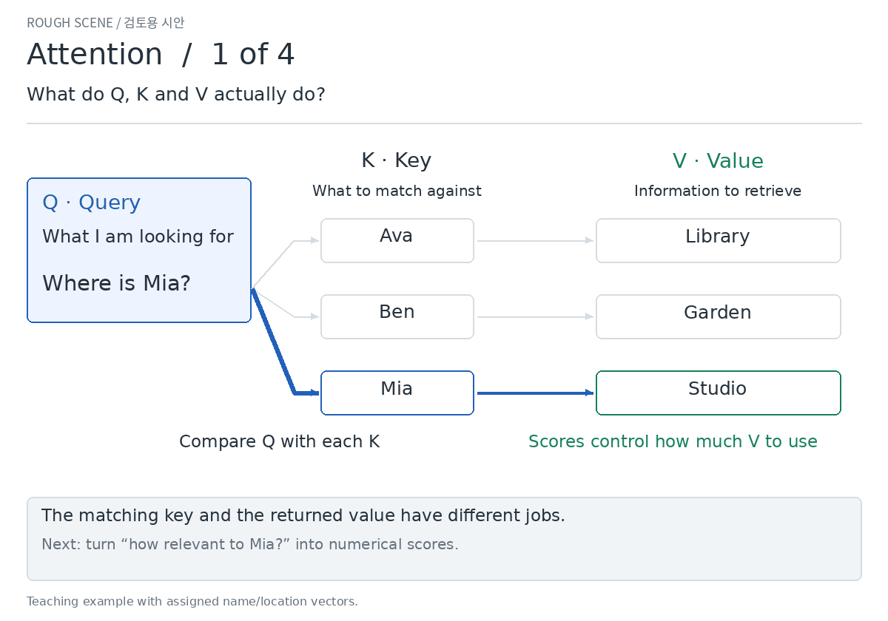
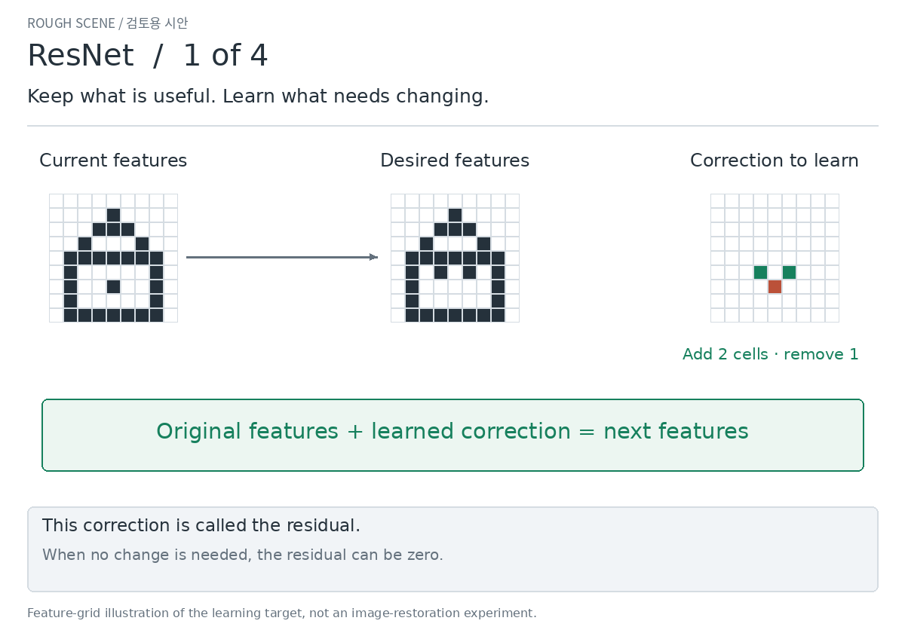

# Attention and ResNet — follow the idea, then explore the math

[한국어](README.ko.md)

Revision 3 aims for the middle difficulty you requested: the mechanism stays,
with concrete examples and short explanations on screen. **Equations are in
the optional details below.** Each 30-second storyboard has four scenes;
open any numbered still to read at your own pace.

## Attention · what should I look at, and how much?

| Scene | Main idea |
| --- | --- |
| [1 · Q, K, V](v3/attention.en.1.png) | A query, a matching label, and the information to retrieve. |
| [2 · How much to use](v3/attention.en.2.png) | A closer match gets a larger share. Softmax converts scores into shares. |
| [3 · Gather information](v3/attention.en.3.png) | Collect more relevant content and smaller amounts of other content; changing the question changes the mixture. |
| [4 · Words and context](v3/attention.en.4.png) | Words refer to one another. Multiple heads can attend to different relationships. |

Keep one idea in mind: **the question changes how much of each piece of information is used.**

## ResNet · what should change, and how does the learning signal return?

| Scene | Main idea |
| --- | --- |
| [1 · Learn the correction](v3/resnet.en.1.png) | Carry existing features forward and learn what to add or remove. |
| [2 · Predict and compare](v3/resnet.en.2.png) | Adding 0.1 to 2.0 gives 2.1, a little below the target 2.2. |
| [3 · Send feedback backward](v3/resnet.en.3.png) | A gradient tells each layer how changes affect the error; the shortcut adds a direct route back. |
| [4 · Reach earlier layers](v3/resnet.en.4.png) | A simple numerical example shows how the shortcut can help the signal reach farther back. |

The shortcut carries useful features forward **and helps the learning signal travel backward**.
The branch still learns. Signal preservation is not guaranteed in every setting.

**Review:** is this explanation level closer to what you wanted? Please point
to any scene that still feels too easy or too difficult. Refinement waits for approval.

Exact calculations, conditions and primary sources

### Attention
[Vaswani et al., §3.2.1 Eq. (1), §§3.2.2–3.2.3](https://arxiv.org/html/1706.03762v7#S3.SS2).

Keys are the 3D basis vectors; location values are one-hot vectors in the order
Library, Garden, Studio. For Mia, Q=√3·[0,0,4], giving scaled scores [0,0,4].
Stable softmax gives [1,1,exp(4)]/(2+exp(4)); these weights are not confidence.
The displayed whole-number percentages are [2,2,96], rounded from the exact weights. This particular rounded triple sums to 100; weights are still computed at full precision.
The name/location vectors are assigned for explanation, not learned language.
Scene 4 illustrates possible “who” and “where” relationships in a cat/sofa/sleep sentence. These are authored explanatory relationships, not measured attention or fixed head roles. Actual head roles arise through training. This scene describes unmasked self-attention; causal masks restrict access in a decoder.
Self-attention uses a common input sequence for Q/K/V; separate learned W
projections determine their roles. Multi-head outputs are concatenated and
projected. No full Transformer training or semantic benchmark is claimed.

### ResNet
[He et al. (2015), §§3.1–3.2 Eq. (1)](https://arxiv.org/html/1512.03385v1#S3)
motivates residual learning through the degradation problem as depth increases.
[He et al. (2016), §2 Eqs. (3)–(5)](https://arxiv.org/html/1603.05027v3#S2)
explains the direct forward/backward terms under identity shortcuts and identity
after-addition activation. The original post-add ReLU has an additional gate.
Our numerical examples have strictly positive preactivations, making that gate
one locally; we also check an inactive gate and cancellation as controls.

Scene 1 uses an authored feature-grid target differing at three cells.
The underlying example for scenes 2–3 uses F(x)=w2·ReLU(w1·x+b1)+b2 with
(w1,b1,w2,b2)=(1,0,−0.1,0.3), x=2, target=2.2,
y=ReLU(x+F(x)) and L=(y−target)²/2.
Thus F=0.1, y=2.1, L=0.005, dL/dy=−0.1, dL/dx=−0.09 and dL/dw2=−0.20.
For this scalar active-ReLU block, dL/dx=(dL/dy)·(1+F′).
In a vector block the corresponding gradient uses the transposed Jacobian.

Scene 4 is a **separate controlled local-derivative illustration**, not a
training comparison. Eight plain blocks use ReLU(−0.1x+1.1); eight residual
blocks use ReLU(x+(−0.1x+0.1)). At x=1, both chains output 1 and have active
ReLUs. The branch slopes are −0.1; biases are chosen separately to match this
forward point. These are different full mappings, not matched trained networks.
For L=x_final²/2, the terminal gradient is 1; the initial feature gradients are
(−0.1)^8=10^−8 and (1−0.1)^8≈0.430. The main scene shows absolute gradient magnitudes relative to a starting value of 100: less than 1 for the plain chain, and approximately 43 for the residual chain. Bar lengths use exact unrounded magnitudes on a linear scale. These are not accuracy, learning speed or a universal ResNet advantage.

Checks include closed-form arithmetic, central finite differences for input
and weight gradients, both deep-chain derivatives, F′=−1 cancellation, and
inactive post-add ReLU. The last two controls produce zero despite a shortcut.
A larger gradient is not automatically a better gradient.

[Rendering and checking code](../../../scripts/render_method_intuition.py);
[numerical record and file hashes](v3/verification.json). Rendered in GitHub Actions.
These small review assets are durable on this branch; the production site is unchanged.

