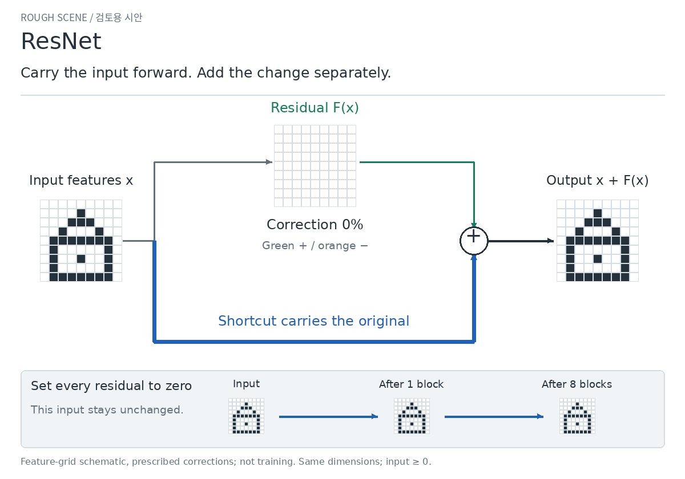

# Method concepts — review before refinement

[한국어](README.ko.md)

These are rough scene proposals. Please judge **what the method does**, not the
visual finish. The production lessons have not been replaced.

## Attention: change the question, change the information retrieved

The three records stay fixed. Ask about Ava, then Mia: the thick route switches
to a different record. A fixed average cannot make that switch.

[Still image](attention.en.png)

**Does the change in which information is used explain attention more clearly?**

## ResNet: carry the input forward, add only the change

The lower route carries the original feature grid. The upper route contributes
only the changed cells. With zero correction, adding more of these blocks
preserves this nonnegative input exactly.

[Still image](resnet.en.png)

**Can you distinguish what the shortcut carries from what the residual adds?**

Please approve or request changes for each scene. Finished films and production
implementation wait for that approval.

Exact meaning and sources

- Attention uses Vaswani et al., [§3.2.1, Eq. (1)](https://arxiv.org/html/1706.03762v7#S3.SS2.SSS1):
  `softmax(q Kᵀ / sqrt(3)) V`. Keys are the three basis vectors, and the query
  is `4 sqrt(3)` times the selected person's basis vector. Values are one-hot
  location vectors. The matching weight is `exp(4)/(exp(4)+2)`; each other weight
  is `1/(exp(4)+2)`. The displayed answer is the largest component of the weighted
  location vector, not a hard selection inside attention. Percentages are weights,
  not confidence or accuracy. Name embeddings are assigned, not learned language.
  This illustrates one attention head, not the complete Transformer, multi-head
  attention, or a trained question-answering system. The reference is specifically
  a fixed mean of those value vectors, not a claim about all other architectures.
- ResNet uses He et al., [§§3.1–3.2, Eq. (1)](https://arxiv.org/html/1512.03385v1#S3):
  a learned branch is parameterized as a residual relative to an identity shortcut.
  Our feature grid is a schematic; its chosen correction removes one cell and
  adds two. For this storyboard we prescribe `F(x)=a·delta`, with `a=0,0.5,1`;
  we compute `ReLU(x+F(x))` but do **not** train or claim to implement a full
  residual CNN. All sums here are nonnegative. Exact preservation with zero
  residual assumes matching dimensions and nonnegative input for this post-add
  ReLU block. A direct mapping can preserve the input too, by learning identity;
  a residual branch needs zero for that same task. This is a parameterization
  comparison, not a measured training-speed or accuracy advantage. The source's
  motivation is degradation when depth increases, not only vanishing gradients.
- The loops use discrete storyboard poses. The correction slider is not a
  training clock. No measured learning curves or claims of universal superiority
  are included. After concept approval, any learning comparison would require
  a separate declared experiment and review of the actual results.
- [Rendering script](../../../scripts/render_method_concepts.py) computes every
  shown grid and weight. GitHub Actions checks the arithmetic and text bounds,
  then renders these small review assets. No production site assets are changed.

