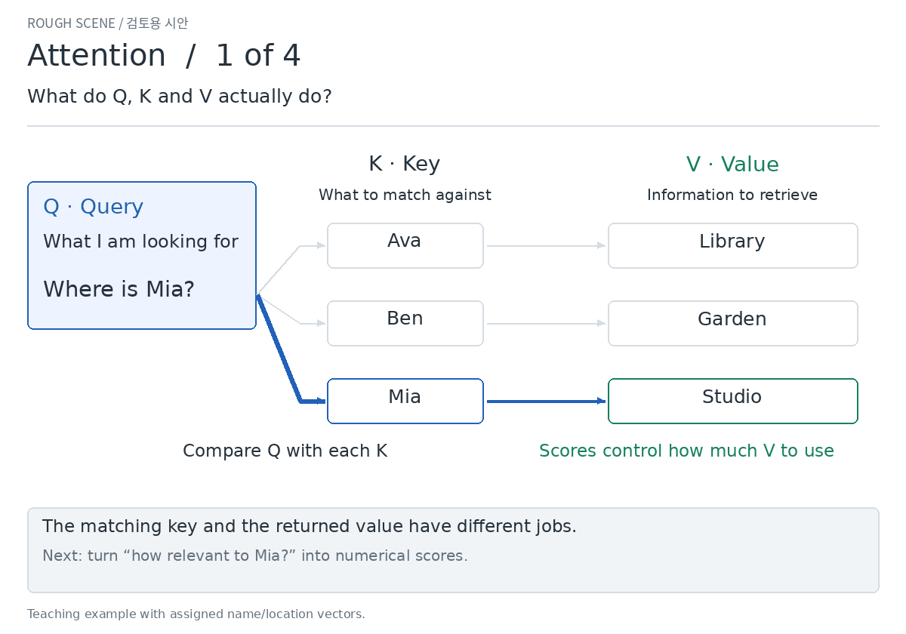
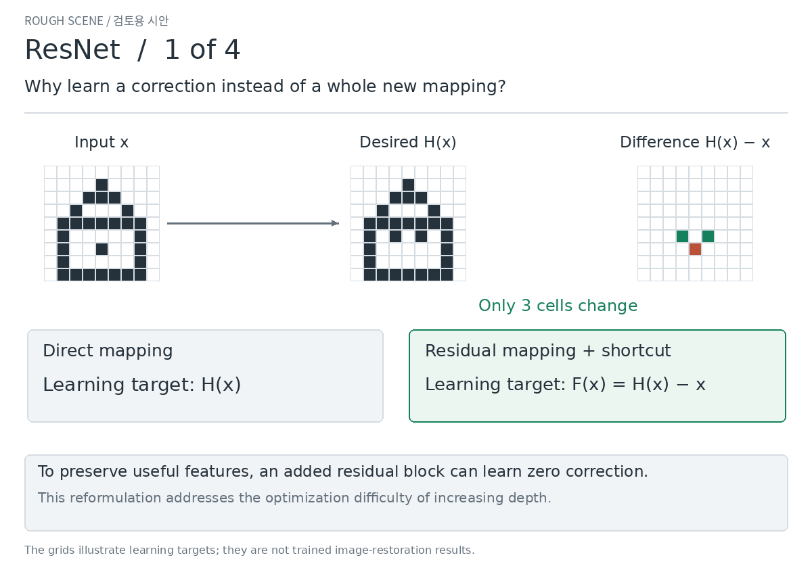

# Attention and ResNet — explanation review, revision 2

[한국어](README.ko.md)

Each method now has **four connected scenes**: what problem it addresses, how it
works, and why its mechanism helps. These are review storyboards; refinement
still waits for your approval. The loops last 30 seconds. Open the numbered
still images below to read at your own pace.

## Attention: how a question changes the information used

| Scene | What to understand |
| --- | --- |
| [1 · Q, K and V](v2/attention.en.1.png) | Q is what we seek; K is what we compare against; V is the information we collect. |
| [2 · Scores and softmax](v2/attention.en.2.png) | Compare Q with every K; scale the scores; turn them into nonnegative weights summing to one. |
| [3 · Weighted sum](v2/attention.en.3.png) | Multiply every V by its weight and add. Attention returns features, not a hard database lookup. |
| [4 · Self-attention and heads](v2/attention.en.4.png) | Each token produces its own Q/K/V through learned projections. Heads use separate projections to gather information. |

The example asks where Mia is. Her key receives the largest score, so Studio
information contributes most to the output. Changing Q to Ava changes the
mixture while K and V stay fixed. The first three scenes compute one head;
the fourth connects that calculation to the Transformer architecture.

## ResNet: residual learning and the backward path

| Scene | What to understand |
| --- | --- |
| [1 · Learn a correction](v2/resnet.en.1.png) | The branch learns H(x)−x; the shortcut carries x. Preserving useful features corresponds to zero residual. |
| [2 · Forward pass](v2/resnet.en.2.png) | Input 2.0 plus correction 0.1 gives prediction 2.1, below the target 2.2. |
| [3 · Backpropagation](v2/resnet.en.3.png) | A gradient says how a small change affects loss. At the addition it flows through both paths; the contributions sum at the earlier feature. |
| [4 · Depth](v2/resnet.en.4.png) | A declared scalar example shows how products of local derivatives affect the signal reaching earlier features. |

In scene 3, a gradient of −0.10 arrives from the loss. The shortcut contributes
−0.10; the branch contributes +0.01. Their sum is −0.09. Backprop also computes
branch-weight gradients: it does not skip learning the branch. This direct
route helps avoid depending entirely on products of small learned derivatives.
It is not a guarantee that gradients can never vanish or explode.

**Review:** do the four Attention scenes now explain how the weights arise and
what they do? Does the backward ResNet scene explain what the shortcut helps
deliver? Please approve each direction or identify the scene that needs revision.

Exact calculations, conditions and primary sources

### Attention
[Vaswani et al., §3.2.1 Eq. (1), §§3.2.2–3.2.3](https://arxiv.org/html/1706.03762v7#S3.SS2).

Keys are the 3D basis vectors; location values are one-hot vectors in the order
Library, Garden, Studio. For Mia, Q=√3·[0,0,4], giving scaled scores [0,0,4].
Stable softmax gives [1,1,exp(4)]/(2+exp(4)); these weights are not confidence.
Percentages are rounded, so displayed values may not add to exactly 100%.
The name/location vectors are assigned for explanation, not learned language.
Scene 4 is an architecture schematic, not measured attention on “The cat sleeps”.
Self-attention uses a common input sequence for Q/K/V; separate learned W
projections determine their roles. Multi-head outputs are concatenated and
projected. No full Transformer training or semantic benchmark is claimed.

### ResNet
[He et al. (2015), §§3.1–3.2 Eq. (1)](https://arxiv.org/html/1512.03385v1#S3)
motivates residual learning through the degradation problem as depth increases.
[He et al. (2016), §2 Eqs. (3)–(5)](https://arxiv.org/html/1603.05027v3#S2)
explains the direct forward/backward terms under identity shortcuts and identity
after-addition activation. The original post-add ReLU has an additional gate.
Our numerical examples have strictly positive preactivations, making that gate
one locally; we also check an inactive gate and cancellation as controls.

Scene 1 uses an authored feature-grid target differing at three cells.
Scenes 2–3 use F(x)=w2·ReLU(w1·x+b1)+b2 with
(w1,b1,w2,b2)=(1,0,−0.1,0.3), x=2, target=2.2,
y=ReLU(x+F(x)) and L=(y−target)²/2.
Thus F=0.1, y=2.1, L=0.005, dL/dy=−0.1, dL/dx=−0.09 and dL/dw2=−0.20.
For this scalar active-ReLU block, dL/dx=(dL/dy)·(1+F′).
In a vector block the corresponding gradient uses the transposed Jacobian.

Scene 4 is a **separate controlled local-derivative illustration**, not a
training comparison. Eight plain blocks use ReLU(−0.1x+1.1); eight residual
blocks use ReLU(x+(−0.1x+0.1)). At x=1, both chains output 1 and have active
ReLUs. The branch slopes are −0.1; biases are chosen separately to match this
forward point. These are different full mappings, not matched trained networks.
For L=x_final²/2, the terminal gradient is 1; the initial feature gradients are
(−0.1)^8=10^−8 and (1−0.1)^8≈0.430. The chart shows absolute gradients on a log
axis, not accuracy, learning speed or a universal ResNet advantage.

Checks include closed-form arithmetic, central finite differences for input
and weight gradients, both deep-chain derivatives, F′=−1 cancellation, and
inactive post-add ReLU. The last two controls produce zero despite a shortcut.
A larger gradient is not automatically a better gradient.

[Rendering and checking code](../../../scripts/render_method_explanations.py);
[numerical record and file hashes](v2/verification.json). Rendered in GitHub Actions.
These small review assets are durable on this branch; the production site is unchanged.

